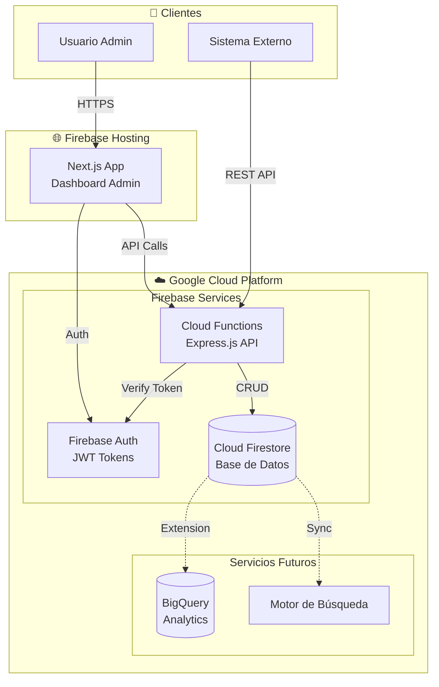
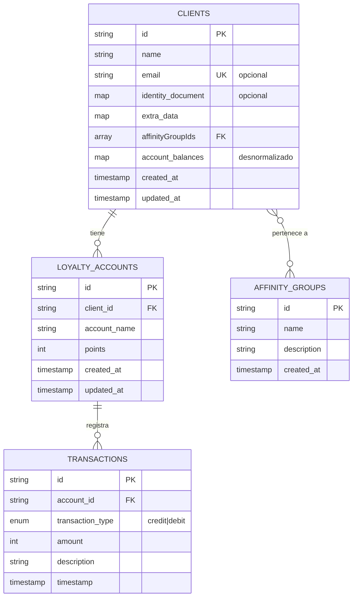
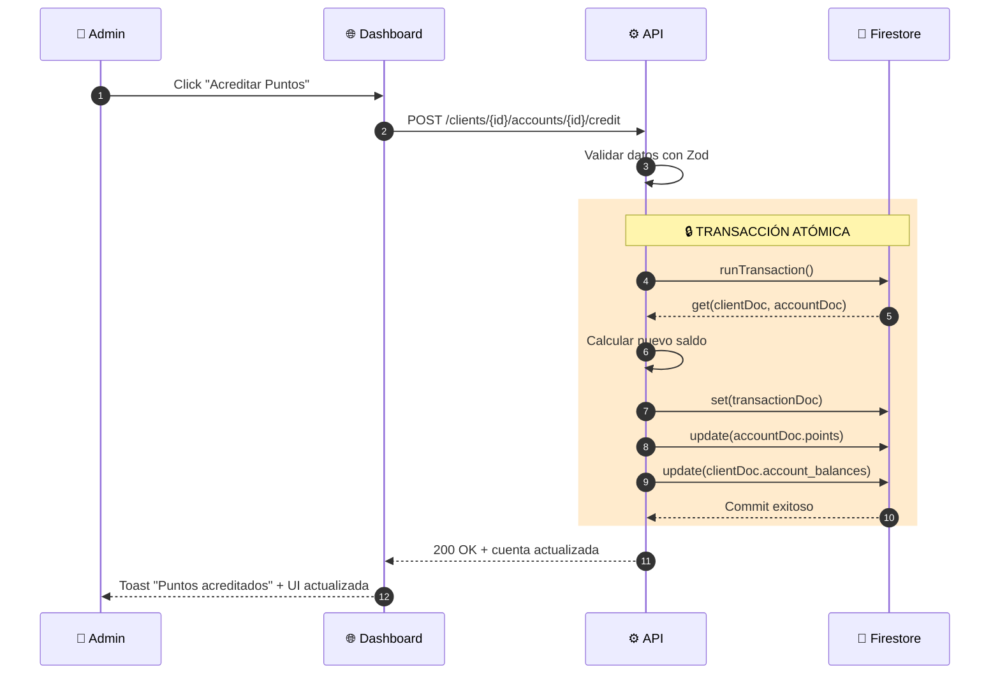
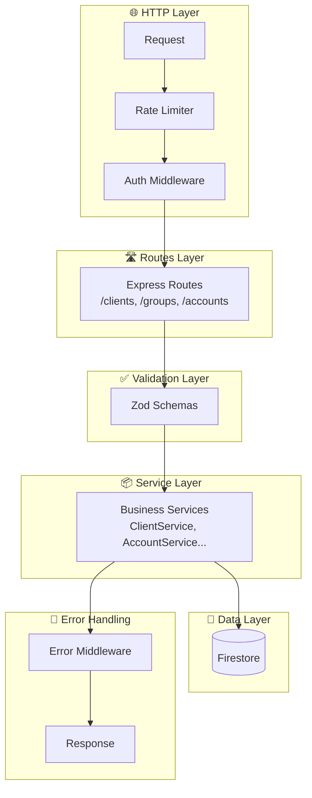
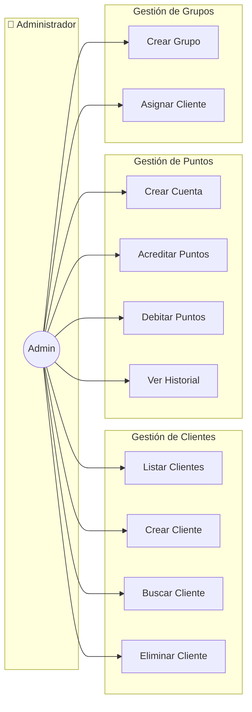

<div align="center">
  
# 🎯 LoyaltyGen

### Plataforma de Lealtad de Clientes API-First

[](https://www.typescriptlang.org/)
[](https://firebase.google.com/)
[](https://nodejs.org/)
[](https://nextjs.org/)

**Una plataforma flexible y potente para implementar sistemas de puntos y programas de afinidad de manera rápida y segura.**

[📖 Documentación](./docs/) · [📋 Plan de Trabajo](./WORK-PLAN.md) · [🔗 API Spec](./openapi.yaml)

</div>

---

## 📌 Tabla de Contenidos

- [Visión del Producto](#-visión-del-producto)
- [Estado del Proyecto](#-estado-del-proyecto)
- [Características Principales](#-características-principales)
- [Arquitectura](#-arquitectura)
- [Pila Tecnológica](#-pila-tecnológica)
- [Documentación](#-documentación)
- [Primeros Pasos](#-primeros-pasos)
- [Estructura del Proyecto](#-estructura-del-proyecto)
- [Contribución](#-contribución)

---

## 🎯 Visión del Producto

**LoyaltyGen** es una plataforma de lealtad de clientes, orientada 100% a ser consumida vía API (API-First). Permite a cualquier empresa, desde startups hasta corporaciones, implementar un sistema de puntos y afinidad sin necesidad de desarrollar la lógica de negocio subyacente.

### Misión

Proporcionar a los desarrolladores una API RESTful, segura, bien documentada y fácil de usar para gestionar:

- 👥 **Clientes** - Registro y gestión de miembros del programa
- 🏷️ **Grupos de Afinidad** - Segmentación y categorización de clientes
- 💳 **Cuentas de Lealtad** - Múltiples programas de puntos por cliente
- 💰 **Transacciones** - Acreditación y débito de puntos con historial completo

---

## 📊 Estado del Proyecto

| Fase | Estado | Descripción |
|------|--------|-------------|
| 1. Diseño y Especificación | ✅ Completada | Documentación de arquitectura, API y guías |
| 2. Implementación Backend | 🔜 Próxima | Cloud Functions, Firestore, Auth |
| 3. Implementación Frontend | 🔜 Pendiente | Dashboard de administración con Next.js |
| 4. Testing y QA | 🔜 Pendiente | Pruebas unitarias e integración |
| 5. Despliegue MVP | 🔜 Pendiente | Producción en Firebase |

> **Fase Actual:** El proyecto ha concluido su fase de diseño, resultando en un conjunto completo de documentos que definen la arquitectura, especificaciones y guías de desarrollo. El siguiente paso es la fase de implementación.

---

## ✨ Características Principales

### Para Desarrolladores (API)

- 🔐 **Autenticación JWT** - Tokens de Firebase Authentication
- 📄 **OpenAPI 3.0** - Contrato de API completo y documentado
- 🔄 **RESTful** - Diseño de API consistente y predecible
- ⚡ **Paginación por Cursor** - Escalable para millones de registros
- 🛡️ **Validación Robusta** - Schemas Zod en backend y frontend

### Para el Negocio

- 💯 **Multi-cuenta** - Múltiples programas de puntos por cliente
- 🏷️ **Grupos de Afinidad** - Segmentación flexible de clientes
- 📊 **Historial Completo** - Trazabilidad de todas las transacciones
- 🔄 **Transacciones Atómicas** - Consistencia garantizada de datos

### Para Administradores (Dashboard)

- 📱 **UI Responsiva** - Acceso desde cualquier dispositivo
- 🎨 **Diseño Moderno** - Tailwind CSS + Shadcn/ui
- ⚡ **Tiempo Real** - Actualizaciones instantáneas con Firestore
- ♿ **Accesible** - Cumplimiento WCAG 2.1 AA

---

## 🏗️ Arquitectura

### Vista General del Sistema



### Componentes Principales

| Componente | Tecnología | Propósito |
|------------|------------|-----------|
| API Gateway | Cloud Functions + Express | Lógica de negocio y endpoints |
| Base de Datos | Cloud Firestore | Almacenamiento transaccional NoSQL |
| Autenticación | Firebase Auth | Gestión de identidad y tokens JWT |
| Frontend | Next.js 14+ | Dashboard de administración |
| Hosting | Firebase Hosting | CDN global con SSL automático |

### Modelo de Datos



### Flujo de Transacciones (Crédito/Débito)



### Arquitectura de Capas (Backend)



### Casos de Uso Principales



> 📚 **Más diagramas disponibles en la [documentación completa](./docs/README.md)**

---

## 🛠️ Pila Tecnológica

### Backend
| Tecnología | Versión | Propósito |
|------------|---------|-----------|
| TypeScript | 5.x | Lenguaje principal |
| Node.js | LTS | Entorno de ejecución |
| Express.js | 4.x | Framework de API |
| Zod | 3.x | Validación de schemas |
| Firebase Admin SDK | 12.x | Servicios de Firebase |

### Frontend
| Tecnología | Versión | Propósito |
|------------|---------|-----------|
| Next.js | 14+ | Framework React con App Router |
| Tailwind CSS | 3.x | Estilos utilitarios |
| Shadcn/ui | Latest | Componentes UI accesibles |
| Zustand | 4.x | Gestión de estado |
| React Hook Form | 7.x | Manejo de formularios |

### Infraestructura
| Servicio | Propósito |
|----------|-----------|
| Cloud Functions for Firebase | Serverless compute |
| Cloud Firestore | Base de datos NoSQL |
| Firebase Authentication | Autenticación de usuarios |
| Firebase Hosting | CDN y hosting estático |

---

## 📚 Documentación

Toda la documentación detallada se encuentra en el directorio [`/docs`](./docs/). Consulta el [README de documentación](./docs/README.md) para una guía completa.

### Documentos Principales

| Documento | Descripción |
|-----------|-------------|
| 📐 [Arquitectura](docs/ARCHITECTURE.md) | Pila tecnológica, componentes y estrategias de escalabilidad |
| 🎯 [Decisiones de Diseño](docs/DESIGN.md) | Registro de decisiones de arquitectura (ADR) |
| 📋 [Especificación de API](openapi.yaml) | Contrato OpenAPI 3.0 - **Fuente de verdad** |
| 🔧 [Guía de API](docs/API-DESIGN.md) | Convenciones de nombrado, versionado y respuestas |
| 📝 [Especificaciones](docs/SPECS.md) | Requisitos funcionales y no funcionales |
| 👤 [Historias de Usuario](docs/USER-STORIES.md) | Funcionalidades del frontend |
| 💻 [Directrices de Código](docs/GUIDELINES.md) | Estilo de código y políticas de seguridad |
| 🎨 [Guía UI/UX](docs/UI-UX-GUIDELINES.md) | Principios de diseño de interfaz |
| 📜 [Manifiesto](docs/STEERING.md) | Visión, misión y principios rectores |

### Documentos de Referencia

| Documento | Descripción |
|-----------|-------------|
| 🔍 [Auditoría de Arquitectura](docs/ARCHITECTURE_AUDIT.md) | Análisis de riesgos y recomendaciones |
| ✅ [Recomendaciones](docs/RECOMMENDATIONS.md) | Informe de auditoría con mitigaciones |
| 📅 [Plan de Trabajo](WORK-PLAN.md) | Épicas, tareas e instrucciones de implementación |

---

## 🚀 Primeros Pasos

### Prerrequisitos

- Node.js 18+ (LTS recomendado)
- npm 9+ o yarn 1.22+
- Firebase CLI (`npm install -g firebase-tools`)
- Cuenta de Google Cloud/Firebase

### Instalación

```bash
# Clonar el repositorio
git clone https://github.com/fnoya/loyalty-gen.git
cd loyalty-gen

# Configurar Firebase (cuando esté implementado)
firebase login
firebase use --add

# Instalar dependencias del backend
cd functions
npm install

# Instalar dependencias del frontend
cd ../web
npm install
```

### Desarrollo Local

```bash
# Iniciar emuladores de Firebase
firebase emulators:start

# En otra terminal, iniciar el frontend
cd web
npm run dev
```

---

## 📁 Estructura del Proyecto

```
loyalty-gen/
├── 📄 README.md              # Este archivo
├── 📄 WORK-PLAN.md           # Plan de trabajo detallado
├── 📄 openapi.yaml           # Especificación OpenAPI 3.0
├── 📁 docs/                  # Documentación del proyecto
│   ├── 📄 README.md          # Índice de documentación
│   ├── 📄 ARCHITECTURE.md    # Arquitectura del sistema
│   ├── 📄 API-DESIGN.md      # Guía de diseño de API
│   ├── 📄 DESIGN.md          # Decisiones de diseño (ADR)
│   ├── 📄 GUIDELINES.md      # Directrices de codificación
│   ├── 📄 SPECS.md           # Especificaciones funcionales
│   ├── 📄 STEERING.md        # Manifiesto del producto
│   ├── 📄 UI-UX-GUIDELINES.md # Guía de UI/UX
│   └── 📄 USER-STORIES.md    # Historias de usuario
├── 📁 functions/             # Backend (Cloud Functions) [Por implementar]
│   ├── 📁 src/
│   │   ├── 📁 api/           # Rutas y middlewares
│   │   ├── 📁 core/          # Errores y utilidades
│   │   ├── 📁 services/      # Lógica de negocio
│   │   └── 📁 schemas/       # Schemas de Zod
│   └── 📄 package.json
└── 📁 web/                   # Frontend (Next.js) [Por implementar]
    ├── 📁 app/               # App Router de Next.js
    ├── 📁 components/        # Componentes React
    └── 📄 package.json
```

---

## 🤝 Contribución

¡Las contribuciones son bienvenidas! Por favor, lee las siguientes guías antes de contribuir:

1. 📖 [Directrices de Codificación](docs/GUIDELINES.md)
2. 🎨 [Guía de UI/UX](docs/UI-UX-GUIDELINES.md)
3. 📋 [Plan de Trabajo](WORK-PLAN.md)

### Proceso de Contribución

1. Fork el repositorio
2. Crea una rama para tu feature (`git checkout -b feature/AmazingFeature`)
3. Sigue las convenciones de [Conventional Commits](https://www.conventionalcommits.org/)
4. Asegúrate de que el código pase linting y tests
5. Crea un Pull Request

---

<div align="center">

**Hecho con ❤️ para la comunidad de desarrolladores**

[⬆ Volver arriba](#-loyaltygen)

</div>

