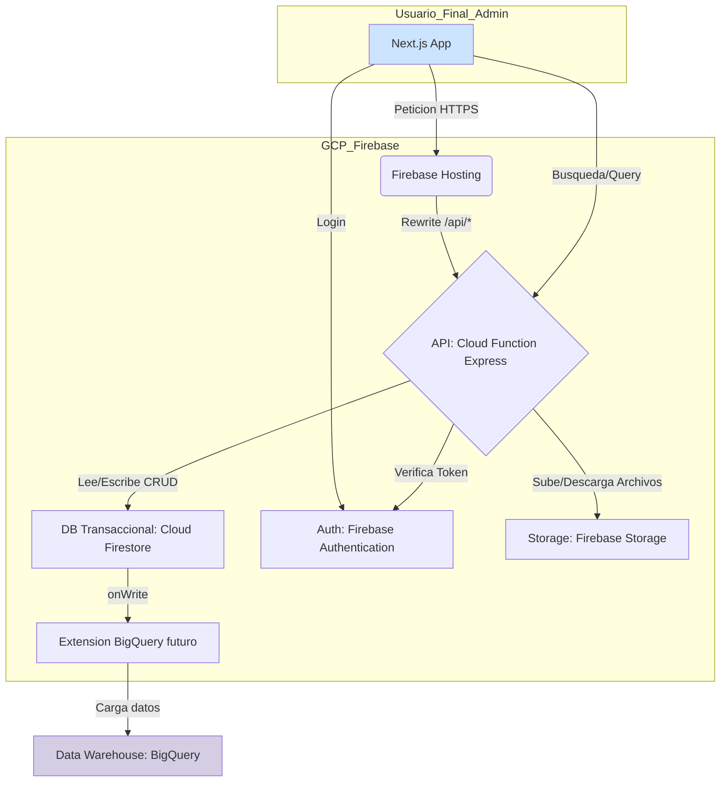

# ARCHITECTURE.md - Arquitectura del Sistema (Stack TypeScript/Firebase)

## 1. Pila Tecnológica (Tech Stack - MVP)

-   **Lenguaje:** **TypeScript**
-   **Entorno de Ejecución:** **Node.js LTS**
-   **Framework de API:** **Express.js** sobre **Cloud Functions for Firebase**.
-   **Base de Datos Transaccional:** **Cloud Firestore**.
-   **Almacenamiento de Archivos:** **Firebase Storage** (para fotos de perfil de clientes).
-   **Autenticación:** **Firebase Authentication**.
-   **Frontend Hosting:** **Firebase Hosting**.
-   **Validación de Datos:** **Zod**.
-   **Análisis de Datos (a futuro):** Google BigQuery.

## 2. Diagrama de Componentes de Alto Nivel (MVP)



## 3. Estrategias para la Escalabilidad

El sistema se diseña para ser escalable, pero la implementación se realizará por fases para controlar la complejidad y los costos iniciales.

### 3.1. Estrategia de Búsqueda

-   **Problema a Largo Plazo:** Firestore no es un motor de búsqueda de texto completo, lo que limita las búsquedas sobre millones de documentos.
-   **Solución Fase 1 (MVP):** Para el lanzamiento inicial, la búsqueda de clientes se implementará utilizando las **capacidades de consulta nativas de Firestore** con las siguientes características:
    -   **Búsqueda por nombre:** Consultas de prefijo (`startsWith`) sobre campos de nombre separados (`firstName`, `secondName`, `firstSurname`, `secondSurname`)
    -   **Búsqueda multi-campo:** Soporte para consultas como "Francisco Noya" que buscan `firstName startsWith "Francisco" AND firstSurname startsWith "Noya"`
    -   **Búsqueda por documento de identidad:** Consultas de prefijo sobre `identity_document.number`
    -   **Búsqueda por teléfono:** Consultas de prefijo sobre el array `phoneNumbers`
    -   **Case-insensitive:** Mediante campos normalizados `_lower` (ej: `firstName_lower`)
    -   **Limitaciones aceptadas:** No hay soporte para `endsWith` en teléfonos (solo `startsWith`), sin tolerancia a typos, sin búsqueda fuzzy
    -   Ver documentación detallada en `docs/FIRESTORE-SEARCH-SOLUTION.md`
-   **Solución Fase 2 (Post-MVP):** Cuando la base de usuarios crezca hasta un punto en que la búsqueda nativa sea insuficiente, se ejecutará la estrategia de integrar un servicio dedicado como **Algolia/Elasticsearch**. La arquitectura está diseñada para que este cambio afecte principalmente al frontend y a la adición de una función de sincronización, sin requerir una reescritura del core de la API.

### 3.2. Estrategia de Análisis de Datos (Analytics)

-   **Problema:** No es eficiente realizar agregaciones complejas sobre la base de datos transaccional en tiempo real.
-   **Solución (Fase 2 / Post-MVP):** Cuando surja la necesidad de business intelligence, se activará la sincronización de datos de Firestore a **Google BigQuery** a través de la extensión oficial de Firebase. Todas las consultas analíticas se realizarán contra BigQuery.

## 4. Modelo de Datos (Estructura de Firestore)

Abandonamos el modelo relacional en favor de una estructura de colecciones y subcolecciones en Firestore, que es más flexible y escalable en este contexto.

-   **`clients` (Colección Raíz)**
    -   Documento: `clientId`
        -   `name: map` (estructura de nombre del cliente)
            -   `firstName: string` (Primer Nombre, obligatorio)
            -   `secondName: string | null` (Segundo Nombre, opcional)
            -   `firstLastName: string` (Primer Apellido, obligatorio)
            -   `secondLastName: string | null` (Segundo Apellido, opcional)
        -   `email: string | null` (opcional, se debe garantizar unicidad a nivel de servicio si existe)
        -   `identity_document: map | null` (opcional, estructura de documento de identidad)
            -   `type: string` (tipo de documento: "cedula_identidad", "pasaporte")
            -   `number: string` (número alfanumérico del documento)
        -   `photoUrl: string | null` (opcional, URL de la foto de perfil en Firebase Storage)
        -   `phones: array<map>` (array de números telefónicos, puede estar vacío)
            -   `type: string` (tipo de teléfono: "mobile", "home", "work", "other")
            -   `number: string` (número telefónico, preferiblemente en formato E.164)
            -   `extension: string | null` (extensión telefónica, opcional)
            -   `isPrimary: boolean` (indica si es el teléfono principal, solo uno puede ser true)
        -   `addresses: array<map>` (array de direcciones físicas, puede estar vacío)
            -   `type: string` (tipo de dirección: "home", "work", "other")
            -   `street: string` (calle)
            -   `buildingBlock: string | null` (edificio, manzana, etc., opcional)
            -   `number: string` (número de dirección)
            -   `apartment: string | null` (apartamento, opcional)
            -   `locality: string` (localidad o ciudad)
            -   `state: string` (departamento, provincia o estado)
            -   `postalCode: string` (código postal)
            -   `country: string` (código de país ISO 3166-1 alpha-2, ej: "UY", "AR")
            -   `isPrimary: boolean` (indica si es la dirección principal, solo una puede ser true)
        -   `extra_data: map` (datos adicionales en formato clave-valor)
        -   `created_at: timestamp`
        -   `updated_at: timestamp`
        -   `affinityGroupIds: array<string>` (Array con los IDs de los grupos a los que pertenece)
        -   **`familyCircle: map | null`** (Información del círculo de afinidad familiar)
            -   `role: string | null` ("holder" = titular, "member" = miembro, null = sin círculo)
            -   `holderId: string | null` (ID del cliente titular, null si role='holder')
            -   `relationshipType: string | null` (tipo de relación: "spouse", "child", "parent", "sibling", "friend", "other")
            -   `joinedAt: timestamp | null` (fecha de adhesión al círculo)
        -   **`familyCircleMembers: array<map> | null`** (Lista de miembros del círculo, solo para titulares)
            -   `memberId: string` (ID del cliente miembro)
            -   `relationshipType: string` (tipo de relación con el titular)
            -   `addedAt: timestamp` (fecha de adhesión)
            -   `addedBy: string` (UID del usuario que lo añadió)
        -   **`account_balances: map` (Campo Desnormalizado para Lecturas Rápidas)**

> **Nota sobre Identificadores de Cliente:**
> - Al menos uno de los identificadores (`email` o `identity_document`) debe estar presente.
> - Si `email` está presente, debe ser único en toda la colección.
> - Si `identity_document` está presente, la combinación de `type` + `number` debe ser única.
> - Se recomienda crear índices compuestos para búsquedas eficientes por `identity_document.type` y `identity_document.number`.
>
> **Nota sobre Campos de Nombre:**
> - Los campos de nombre se han separado en componentes individuales (firstName, secondName, firstSurname, secondSurname) para permitir búsquedas efectivas en Firestore.
> - Los campos `_lower` son versiones en minúsculas almacenadas para permitir búsquedas case-insensitive, ya que Firestore es sensible a mayúsculas/minúsculas.
> - `firstName` y `firstSurname` son requeridos; `secondName` y `secondSurname` son opcionales.
> - Ver `docs/FIRESTORE-SEARCH-SOLUTION.md` para detalles completos sobre la estrategia de búsqueda.

> **Nota sobre Datos de Contacto y Dirección:**
> - Los campos `phones` y `addresses` son arrays que pueden estar vacíos.
> - Solo un elemento en cada array puede tener `isPrimary: true`.
> - Los números telefónicos deben validarse en formato E.164 cuando sea posible (+código_país número).
> - Los códigos de país en direcciones deben seguir el estándar ISO 3166-1 alpha-2.
> - Se recomienda crear índices compuestos para búsquedas por `name.firstLastName` y `name.secondLastName`.
> - **Seguridad:** Los campos `phones` y `addresses` contienen PII y NO deben registrarse en logs de aplicación.

> **Nota sobre Círculos de Afinidad Familiares:**
> - Un cliente puede ser **titular** (`role: 'holder'`) de un círculo o **miembro** (`role: 'member'`) de otro, pero NO ambos simultáneamente.
> - **Restricción de unicidad:** Un cliente solo puede pertenecer a UN círculo de afinidad a la vez.
> - Solo el titular puede gestionar (añadir/remover) miembros de su círculo.
> - Los miembros pueden originar transacciones en cuentas del titular según la configuración de permisos de cada cuenta.
> - Tipos de relación soportados: cónyuge (spouse), hijo (child), padre/madre (parent), hermano (sibling), amigo (friend), otro (other).
> - Se requieren índices compuestos para consultas por `familyCircle.holderId` y `familyCircle.joinedAt`.

-   **`affinityGroups` (Colección Raíz)**
    -   Documento: `groupId`
        -   `name: string`
        -   `description: string`
        -   `created_at: timestamp`

-   **`loyaltyAccounts` (Subcolección de Cliente)**
    -   Ruta: `clients/{clientId}/loyaltyAccounts/{accountId}`
    -   Documento: `accountId`
        -   `account_name: string`
        -   `points: number` (integer)
        -   `created_at: timestamp`
        -   `updated_at: timestamp`
        -   **`familyCircleConfig: map | null`** (Configuración de permisos para círculo familiar)
            -   `allowMemberCredits: boolean` (¿Los miembros del círculo pueden generar créditos?)
            -   `allowMemberDebits: boolean` (¿Los miembros del círculo pueden generar débitos?)
            -   `updatedAt: timestamp`
            -   `updatedBy: string` (UID del usuario que actualizó la configuración)

-   **`pointTransactions` (Subcolección de Cuenta de Lealtad)**
    -   Ruta: `clients/{clientId}/loyaltyAccounts/{accountId}/transactions/{transactionId}`
    -   Documento: `transactionId`
        -   `transaction_type: "credit" | "debit"`
        -   `amount: number` (siempre positivo)
        -   `description: string`
        -   `timestamp: timestamp`
        -   **`originatedBy: map | null`** (Información del originador si es miembro del círculo)
            -   `clientId: string` (ID del cliente que originó la transacción)
            -   `isCircleMember: boolean` (true si es miembro del círculo, false si es el titular)
            -   `relationshipType: string | null` (tipo de relación con el titular)

> **Nota Crítica sobre Desnormalización:**
> La sincronización del campo `account_balances` en `client` mediante transacciones atómicas de Firestore es **mandatoria** para garantizar la consistencia de los datos y es aún más crítica a esta escala.

## 4.1. Almacenamiento de Fotos de Perfil (Firebase Storage)

Las fotos de perfil de los clientes se almacenan en **Firebase Storage** en lugar de codificarlas en Base64 dentro de Firestore. Esta estrategia optimiza el rendimiento, reduce costos y escala mejor.

### 4.1.1. Estructura de Almacenamiento

-   **Ubicación:** Las fotos se almacenan en Firebase Storage bajo la ruta:
    ```
    /client-photos/{clientId}/{timestamp}_{filename}
    ```
    -   `{clientId}`: ID único del cliente en Firestore
    -   `{timestamp}`: Timestamp Unix en milisegundos para evitar colisiones
    -   `{filename}`: Nombre original del archivo sanitizado

-   **Campo en Firestore:** El documento del cliente en Firestore contiene un campo `photoUrl: string | null` que almacena la URL pública de acceso a la foto.

### 4.1.2. Validaciones y Restricciones

-   **Formatos Soportados:** JPEG, PNG, WEBP
-   **Tamaño Máximo:** 5 MB por archivo
-   **Dimensiones Recomendadas:** 512x512 píxeles o superior (aspecto cuadrado preferido)
-   **Validación de Tipo MIME:** El backend debe verificar el tipo MIME del archivo, no solo la extensión

### 4.1.3. Proceso de Subida

1.  **Upload:** El cliente sube la foto vía `POST /api/v1/clients/{client_id}/photo`
2.  **Validación:** El backend valida formato, tamaño y tipo MIME
3.  **Almacenamiento:** La foto se guarda en Firebase Storage con metadata (clientId, timestamp)
4.  **URL Pública:** Se genera una URL pública con token de acceso
5.  **Actualización Firestore:** El campo `photoUrl` del cliente se actualiza en Firestore
6.  **Limpieza:** Si existía una foto anterior, se elimina de Storage de forma asíncrona

### 4.1.4. Proceso de Eliminación

-   **Endpoint:** `DELETE /api/v1/clients/{client_id}/photo`
-   **Operación:** 
    1. Se elimina el archivo de Firebase Storage
    2. Se establece `photoUrl: null` en el documento del cliente

### 4.1.5. Consideraciones de Seguridad

-   **Reglas de Storage:** Solo usuarios autenticados pueden subir/eliminar fotos
-   **Validación de Propietario:** El usuario debe tener permisos sobre el cliente para modificar su foto
-   **URLs Firmadas:** Las URLs de acceso incluyen tokens de seguridad de Firebase
-   **Prevención de Malware:** Considerar integración con Cloud Vision API o similar para detección de contenido inapropiado (Post-MVP)

### 4.1.6. Optimización de Rendimiento (Post-MVP)

-   **Generación de Thumbnails:** Usar Firebase Extensions (Resize Images) para crear versiones optimizadas automáticamente
-   **CDN:** Firebase Storage sirve archivos a través de Google Cloud CDN por defecto
-   **Compresión:** Implementar compresión de imágenes del lado del cliente antes de la subida

> **Nota sobre PII (Información Personal Identificable):**
> Las fotos de perfil contienen PII visual. Las URLs de fotos **NO deben registrarse en logs de aplicación**. Utilizar referencias opacas (ej: "photo exists") en logs en lugar de URLs completas.

## 4.2. Modelo de Datos de Auditoría

Dado que el sistema maneja información sensible sobre créditos, débitos y balances de puntos, todas las operaciones deben quedar auditadas para garantizar trazabilidad completa.

-   **`auditLogs` (Colección Raíz)**
    -   Documento: `auditLogId` (auto-generado)
        -   `action: string` - Tipo de acción realizada. Valores posibles:
            -   `"CLIENT_CREATED"` - Cliente creado
            -   `"CLIENT_UPDATED"` - Cliente actualizado
            -   `"CLIENT_DELETED"` - Cliente eliminado (proceso iniciado)
            -   `"ACCOUNT_CREATED"` - Cuenta de lealtad creada
            -   `"POINTS_CREDITED"` - Puntos acreditados
            -   `"POINTS_DEBITED"` - Puntos debitados
            -   `"GROUP_CREATED"` - Grupo de afinidad creado
            -   `"CLIENT_ADDED_TO_GROUP"` - Cliente añadido a grupo
            -   `"CLIENT_REMOVED_FROM_GROUP"` - Cliente removido de grupo
            -   **`"FAMILY_CIRCLE_MEMBER_ADDED"`** - Miembro añadido al círculo familiar
            -   **`"FAMILY_CIRCLE_MEMBER_REMOVED"`** - Miembro removido del círculo familiar
            -   **`"LOYALTY_ACCOUNT_FAMILY_CONFIG_UPDATED"`** - Configuración de círculo familiar de cuenta actualizada
            -   **`"POINTS_CREDITED_BY_CIRCLE_MEMBER"`** - Puntos acreditados por miembro del círculo
            -   **`"POINTS_DEBITED_BY_CIRCLE_MEMBER"`** - Puntos debitados por miembro del círculo
        -   `resource_type: string` - Tipo de recurso afectado (`"client"`, `"account"`, `"transaction"`, `"group"`)
        -   `resource_id: string` - ID del recurso principal afectado
        -   `client_id: string | null` - ID del cliente relacionado (para facilitar consultas por cliente)
        -   `account_id: string | null` - ID de la cuenta relacionada (para facilitar consultas por cuenta)
        -   `group_id: string | null` - ID del grupo relacionado (para operaciones de grupos de afinidad)
        -   `transaction_id: string | null` - ID de la transacción relacionada (solo para operaciones de crédito/débito)
        -   `actor: map` - Información del usuario que realizó la acción
            -   `uid: string` - ID del usuario autenticado (Firebase Auth UID)
            -   `email: string | null` - Email del actor (para referencia histórica)
        -   `changes: map | null` - Detalle de los cambios realizados (opcional, para actualizaciones)
            -   `before: map | null` - Estado anterior del recurso (campos relevantes)
            -   `after: map | null` - Estado posterior del recurso (campos relevantes)
        -   `metadata: map` - Información adicional de contexto
            -   `ip_address: string | null` - Dirección IP del cliente (si está disponible)
            -   `user_agent: string | null` - User agent del cliente (si está disponible)
            -   `description: string | null` - Descripción adicional de la operación
        -   `timestamp: timestamp` - Momento exacto de la operación

> **Nota sobre Índices de Auditoría:**
> Se deben crear índices compuestos para las siguientes consultas frecuentes:
> - Por `client_id` + `timestamp` (DESC) - Para ver auditoría de un cliente
> - Por `account_id` + `timestamp` (DESC) - Para ver auditoría de una cuenta
> - Por `group_id` + `timestamp` (DESC) - Para ver auditoría de un grupo
> - Por `transaction_id` - Para ver auditoría de una transacción específica
> - Por `actor.uid` + `timestamp` (DESC) - Para ver acciones de un usuario específico
> - Por `action` + `timestamp` (DESC) - Para filtrar por tipo de acción

> **Política de Retención:**
> Los registros de auditoría deben conservarse por un período mínimo de 5 años para cumplir con requisitos regulatorios. Se debe implementar una política de archivado a BigQuery para registros antiguos.

> **Nota sobre Rendimiento y Atomicidad:**
> - **Operaciones financieras** (`POINTS_CREDITED`, `POINTS_DEBITED`): El registro de auditoría **DEBE** crearse dentro de la misma transacción atómica de Firestore que actualiza el balance. Esto garantiza consistencia entre la operación y su auditoría.
> - **Operaciones no financieras** (todas las demás): Los registros de auditoría se crean después de completar la operación principal. Si la creación del registro falla, se debe loguear el error pero no revertir la operación.

## 5. Arquitectura de la API (Monolito Modular vs. Microservicios)

-   **Decisión Inicial:** Se mantiene el enfoque de **"monolito modular serverless"** para el MVP.
-   **Consideración de Escala:** Los requisitos de alta escalabilidad hacen probable que en el futuro sea necesario desacoplar dominios en microservicios. La arquitectura modular actual está pensada para facilitar esta transición.

## 6. Estructura de la API

La API REST se basa en una aplicación Express desplegada como una única Cloud Function (`api`). Firebase Hosting se configurará para redirigir todas las peticiones de `/api/*` a esta función.

## 7. Estrategia de Manejo de Errores

Se implementará un flujo de manejo de errores centralizado para mejorar la robustez y la experiencia del desarrollador.

1.  **Capa de Servicio (`*.service.ts`):** Cuando ocurre un error de negocio predecible (ej. saldo insuficiente), la lógica de servicio **lanza una clase de error personalizada** (ej. `class InsufficientBalanceError extends Error {}`).
2.  **Capa de Controlador/Ruta:** Los controladores son agnósticos a los errores y simplemente llaman a los servicios dentro de un bloque `try...catch` (o usan un wrapper para rutas asíncronas).
3.  **Middleware de Error (Express):** Un middleware de manejo de errores, colocado al final de la pila de Express, intercepta cualquier error lanzado. Este middleware:
    -   Identifica el tipo de error (usando `instanceof`).
    -   Mapea el error a un código de estado HTTP y a un formato de respuesta de error estandarizado, como se define en `API-DESIGN.md`.
    -   Envía la respuesta JSON estandarizada al cliente.

## 8. Operaciones Asíncronas (Eliminación en Cascada)

La eliminación de un cliente y todos sus datos anidados (cuentas, transacciones) es una operación compleja en Firestore que no puede completarse en una única llamada atómica a la API.

-   **Estrategia:** La eliminación se gestionará de forma asíncrona.
-   **Implementación Recomendada:**
    1.  **Extensión "Delete User Data":** La opción preferida es utilizar la extensión oficial de Firebase. Se puede configurar para que se active al eliminar un usuario de Firebase Auth o se puede invocar manualmente. Esto delega la lógica de borrado recursivo a una solución probada y mantenida.
    2.  **Cloud Function Personalizada (Alternativa):** Si se requiere más control, se puede crear una Cloud Function específica para esta tarea. La función debe leer y eliminar documentos en lotes (`WriteBatch`) para evitar exceder los límites de tiempo de ejecución y memoria.
-   **Impacto en la API:** La petición `DELETE /clients/{client_id}` no esperará a que se complete el borrado. Devolverá una respuesta `202. Accepted` para indicar que el proceso ha comenzado.

## 9. Estrategia de Indexación en Firestore

Firestore crea índices automáticos para consultas simples, pero las queries más complejas requieren una estrategia de indexación manual.

-   **Índices Compuestos:** Para cualquier consulta que filtre por un campo y ordene por otro, se deberá crear un **índice compuesto**.
-   **Ejemplo:** Una consulta que busque clientes por `email` (`where('email', '==', ...)`) y los ordene por fecha de creación (`orderBy('created_at', 'desc')`) necesitará un índice compuesto.
-   **Desarrollo:** Durante el desarrollo con el Emulador de Firebase, la consola registrará mensajes de error con un enlace directo para crear el índice faltante en la consola de Google Cloud. Es una práctica obligatoria revisar estos logs y crear los índices necesarios.

## 10. Seguridad de la Arquitectura

### 10.1. Principio de Menor Privilegio (PoLP)

La seguridad se refuerza aplicando el Principio de Menor Privilegio a las cuentas de servicio.

-   **Requisito:** La cuenta de servicio asociada a la Cloud Function `api` **no debe** tener roles amplios como `Editor`. Debe tener únicamente los permisos de IAM estrictamente necesarios para su operación.
-   **Roles Mínimos:**
    -   `roles/datastore.user`: Para leer y escribir en Cloud Firestore.
    -   `roles/cloudfunctions.invoker`: Para permitir que sea invocada a través de HTTP.
    -   Permisos específicos si interactúa con otros servicios.

## 11. Arquitectura del Frontend (Aplicación Cliente)

-   **Framework:** **Next.js (v14+)** con **App Router**.
-   **Estilos:** **Tailwind CSS**.
-   **Componentes UI:** **Shadcn/ui**.
-   **Gestión de Estado:** **Zustand**.
-   **Alojamiento (Hosting):**
    -   **Plataforma:** **Firebase Hosting**.
    -   **Justificación:**
        -   **CDN Global:** Distribución de contenido estático de baja latencia.
        -   **Integración Nativa:** Se integra perfectamente con Cloud Functions, permitiendo reescribir rutas (`rewrites`) para que `/api/*` apunte a la función de backend. Esto simplifica la configuración de CORS y la gestión de URLs.
        -   **Seguridad:** Provee certificados SSL automáticos y gratuitos.

## 12. Estructura de Directorios del Proyecto

El agente de IA deberá generar la estructura estándar de un proyecto de Firebase Functions con TypeScript.

```
/loyalty-gen
├── functions/
│   ├── src/
│   │   ├── api/
│   │   │   ├── routes/
│   │   │   └── middleware/
│   │   ├── core/
│   │   ├── models/
│   │   ├── services/
│   │   ├── schemas/
│   │   └── index.ts
│   └── ...
├── .firebaserc
├── firebase.json
├── firestore.rules
└── .gitignore
```

