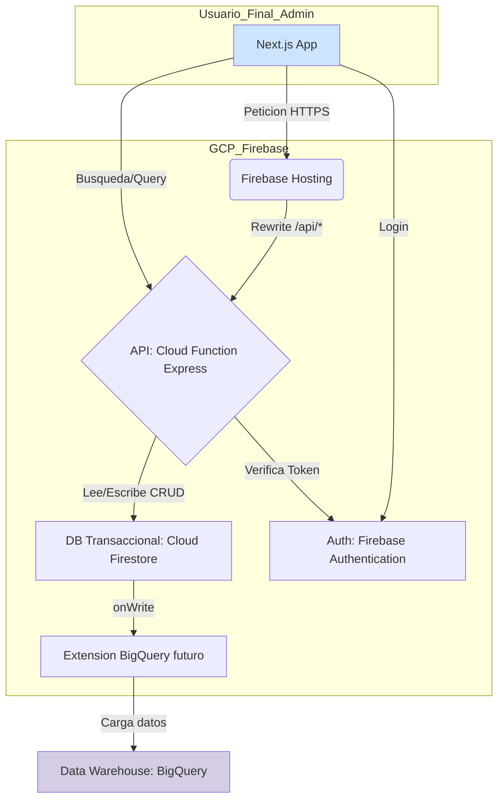

# ARCHITECTURE.md - Arquitectura del Sistema (Stack TypeScript/Firebase)

## 1. Pila Tecnológica (Tech Stack - MVP)

-   **Lenguaje:** **TypeScript**
-   **Entorno de Ejecución:** **Node.js LTS**
-   **Framework de API:** **Express.js** sobre **Cloud Functions for Firebase**.
-   **Base de Datos Transaccional:** **Cloud Firestore**.
-   **Autenticación:** **Firebase Authentication**.
-   **Frontend Hosting:** **Firebase Hosting**.
-   **Validación de Datos:** **Zod**.
-   **Análisis de Datos (a futuro):** Google BigQuery.

## 2. Diagrama de Componentes de Alto Nivel (MVP)



## 3. Estrategias para la Escalabilidad

El sistema se diseña para ser escalable, pero la implementación se realizará por fases para controlar la complejidad y los costos iniciales.

### 3.1. Estrategia de Búsqueda

-   **Problema a Largo Plazo:** Firestore no es un motor de búsqueda de texto completo, lo que limita las búsquedas sobre millones de documentos.
-   **Solución Fase 1 (MVP):** Para el lanzamiento inicial, la búsqueda de clientes se implementará utilizando las **capacidades de consulta nativas de Firestore**. Esto implica principalmente consultas de prefijo (`startsWith`) sobre campos indexados. Se aceptan las limitaciones de esta aproximación (sensibilidad a mayúsculas/minúsculas, sin tolerancia a typos).
-   **Solución Fase 2 (Post-MVP):** Cuando la base de usuarios crezca hasta un punto en que la búsqueda nativa sea insuficiente, se ejecutará la estrategia de integrar un servicio dedicado como **Algolia/Elasticsearch**. La arquitectura está diseñada para que este cambio afecte principalmente al frontend y a la adición de una función de sincronización, sin requerir una reescritura del core de la API.

### 3.2. Estrategia de Análisis de Datos (Analytics)

-   **Problema:** No es eficiente realizar agregaciones complejas sobre la base de datos transaccional en tiempo real.
-   **Solución (Fase 2 / Post-MVP):** Cuando surja la necesidad de business intelligence, se activará la sincronización de datos de Firestore a **Google BigQuery** a través de la extensión oficial de Firebase. Todas las consultas analíticas se realizarán contra BigQuery.

## 4. Modelo de Datos (Estructura de Firestore)

Abandonamos el modelo relacional en favor de una estructura de colecciones y subcolecciones en Firestore, que es más flexible y escalable en este contexto.

-   **`clients` (Colección Raíz)**
    -   Documento: `clientId`
        -   `name: string`
        -   `email: string | null` (opcional, se debe garantizar unicidad a nivel de servicio si existe)
        -   `identity_document: map | null` (opcional, estructura de documento de identidad)
            -   `type: string` (tipo de documento: "cedula_identidad", "pasaporte")
            -   `number: string` (número alfanumérico del documento)
        -   `extra_data: map`
        -   `created_at: timestamp`
        -   `updated_at: timestamp`
        -   `affinityGroupIds: array<string>` (Array con los IDs de los grupos a los que pertenece)
        -   **`account_balances: map` (Campo Desnormalizado para Lecturas Rápidas)**

> **Nota sobre Identificadores de Cliente:**
> - Al menos uno de los identificadores (`email` o `identity_document`) debe estar presente.
> - Si `email` está presente, debe ser único en toda la colección.
> - Si `identity_document` está presente, la combinación de `type` + `number` debe ser única.
> - Se recomienda crear índices compuestos para búsquedas eficientes por `identity_document.type` y `identity_document.number`.

-   **`affinityGroups` (Colección Raíz)**
    -   Documento: `groupId`
        -   `name: string`
        -   `description: string`
        -   `created_at: timestamp`

-   **`loyaltyAccounts` (Subcolección de Cliente)**
    -   Ruta: `clients/{clientId}/loyaltyAccounts/{accountId}`
    -   Documento: `accountId`
        -   `account_name: string`
        -   `points: number` (integer)
        -   `created_at: timestamp`
        -   `updated_at: timestamp`

-   **`pointTransactions` (Subcolección de Cuenta de Lealtad)**
    -   Ruta: `clients/{clientId}/loyaltyAccounts/{accountId}/transactions/{transactionId}`
    -   Documento: `transactionId`
        -   `transaction_type: "credit" | "debit"`
        -   `amount: number` (siempre positivo)
        -   `description: string`
        -   `timestamp: timestamp`

> **Nota Crítica sobre Desnormalización:**
> La sincronización del campo `account_balances` en `client` mediante transacciones atómicas de Firestore es **mandatoria** para garantizar la consistencia de los datos y es aún más crítica a esta escala.

## 5. Arquitectura de la API (Monolito Modular vs. Microservicios)

-   **Decisión Inicial:** Se mantiene el enfoque de **"monolito modular serverless"** para el MVP.
-   **Consideración de Escala:** Los requisitos de alta escalabilidad hacen probable que en el futuro sea necesario desacoplar dominios en microservicios. La arquitectura modular actual está pensada para facilitar esta transición.

## 6. Estructura de la API

La API REST se basa en una aplicación Express desplegada como una única Cloud Function (`api`). Firebase Hosting se configurará para redirigir todas las peticiones de `/api/*` a esta función.

## 7. Estrategia de Manejo de Errores

Se implementará un flujo de manejo de errores centralizado para mejorar la robustez y la experiencia del desarrollador.

1.  **Capa de Servicio (`*.service.ts`):** Cuando ocurre un error de negocio predecible (ej. saldo insuficiente), la lógica de servicio **lanza una clase de error personalizada** (ej. `class InsufficientBalanceError extends Error {}`).
2.  **Capa de Controlador/Ruta:** Los controladores son agnósticos a los errores y simplemente llaman a los servicios dentro de un bloque `try...catch` (o usan un wrapper para rutas asíncronas).
3.  **Middleware de Error (Express):** Un middleware de manejo de errores, colocado al final de la pila de Express, intercepta cualquier error lanzado. Este middleware:
    -   Identifica el tipo de error (usando `instanceof`).
    -   Mapea el error a un código de estado HTTP y a un formato de respuesta de error estandarizado, como se define en `API-DESIGN.md`.
    -   Envía la respuesta JSON estandarizada al cliente.

## 8. Operaciones Asíncronas (Eliminación en Cascada)

La eliminación de un cliente y todos sus datos anidados (cuentas, transacciones) es una operación compleja en Firestore que no puede completarse en una única llamada atómica a la API.

-   **Estrategia:** La eliminación se gestionará de forma asíncrona.
-   **Implementación Recomendada:**
    1.  **Extensión "Delete User Data":** La opción preferida es utilizar la extensión oficial de Firebase. Se puede configurar para que se active al eliminar un usuario de Firebase Auth o se puede invocar manualmente. Esto delega la lógica de borrado recursivo a una solución probada y mantenida.
    2.  **Cloud Function Personalizada (Alternativa):** Si se requiere más control, se puede crear una Cloud Function específica para esta tarea. La función debe leer y eliminar documentos en lotes (`WriteBatch`) para evitar exceder los límites de tiempo de ejecución y memoria.
-   **Impacto en la API:** La petición `DELETE /clients/{client_id}` no esperará a que se complete el borrado. Devolverá una respuesta `202. Accepted` para indicar que el proceso ha comenzado.

## 9. Estrategia de Indexación en Firestore

Firestore crea índices automáticos para consultas simples, pero las queries más complejas requieren una estrategia de indexación manual.

-   **Índices Compuestos:** Para cualquier consulta que filtre por un campo y ordene por otro, se deberá crear un **índice compuesto**.
-   **Ejemplo:** Una consulta que busque clientes por `email` (`where('email', '==', ...)`) y los ordene por fecha de creación (`orderBy('created_at', 'desc')`) necesitará un índice compuesto.
-   **Desarrollo:** Durante el desarrollo con el Emulador de Firebase, la consola registrará mensajes de error con un enlace directo para crear el índice faltante en la consola de Google Cloud. Es una práctica obligatoria revisar estos logs y crear los índices necesarios.

## 10. Seguridad de la Arquitectura

### 10.1. Principio de Menor Privilegio (PoLP)

La seguridad se refuerza aplicando el Principio de Menor Privilegio a las cuentas de servicio.

-   **Requisito:** La cuenta de servicio asociada a la Cloud Function `api` **no debe** tener roles amplios como `Editor`. Debe tener únicamente los permisos de IAM estrictamente necesarios para su operación.
-   **Roles Mínimos:**
    -   `roles/datastore.user`: Para leer y escribir en Cloud Firestore.
    -   `roles/cloudfunctions.invoker`: Para permitir que sea invocada a través de HTTP.
    -   Permisos específicos si interactúa con otros servicios.

## 11. Arquitectura del Frontend (Aplicación Cliente)

-   **Framework:** **Next.js (v14+)** con **App Router**.
-   **Estilos:** **Tailwind CSS**.
-   **Componentes UI:** **Shadcn/ui**.
-   **Gestión de Estado:** **Zustand**.
-   **Alojamiento (Hosting):**
    -   **Plataforma:** **Firebase Hosting**.
    -   **Justificación:**
        -   **CDN Global:** Distribución de contenido estático de baja latencia.
        -   **Integración Nativa:** Se integra perfectamente con Cloud Functions, permitiendo reescribir rutas (`rewrites`) para que `/api/*` apunte a la función de backend. Esto simplifica la configuración de CORS y la gestión de URLs.
        -   **Seguridad:** Provee certificados SSL automáticos y gratuitos.

## 12. Estructura de Directorios del Proyecto

El agente de IA deberá generar la estructura estándar de un proyecto de Firebase Functions con TypeScript.

```
/loyalty-gen
├── functions/
│   ├── src/
│   │   ├── api/
│   │   │   ├── routes/
│   │   │   └── middleware/
│   │   ├── core/
│   │   ├── models/
│   │   ├── services/
│   │   ├── schemas/
│   │   └── index.ts
│   └── ...
├── .firebaserc
├── firebase.json
├── firestore.rules
└── .gitignore
```

