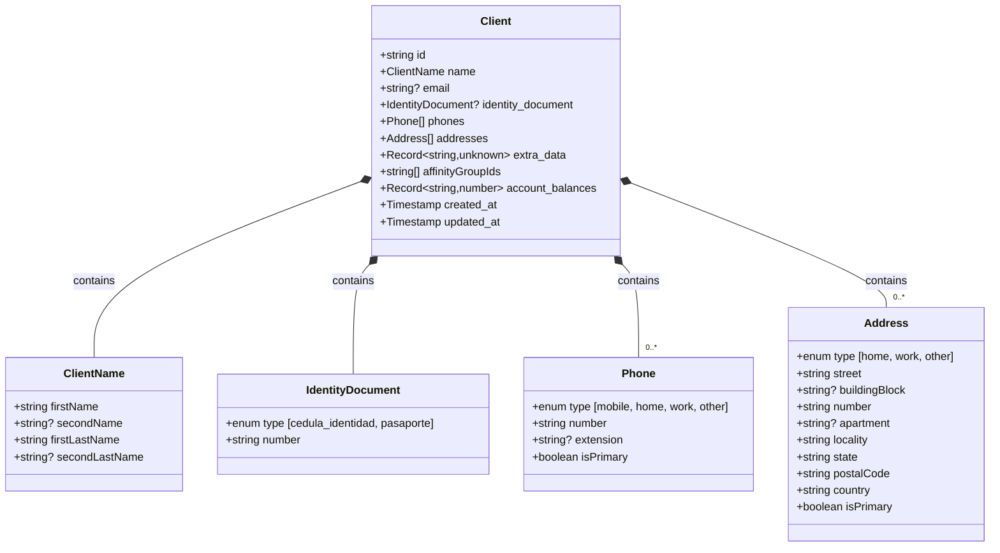
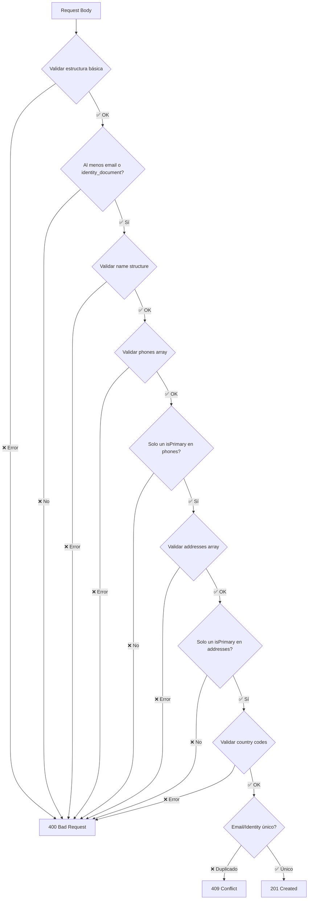

# Diagrama de Modelo de Datos - Cliente Ampliado

## Estructura Visual del Cliente



## Reglas de Validación

### ClientName
- ✅ `firstName`: OBLIGATORIO, 1-50 caracteres, patrón: `/^[a-zA-ZáéíóúÁÉÍÓÚñÑüÜ\s'-]+$/`
- ⚪ `secondName`: OPCIONAL, max 50 caracteres, mismo patrón
- ✅ `firstLastName`: OBLIGATORIO, 1-50 caracteres, mismo patrón
- ⚪ `secondLastName`: OPCIONAL, max 50 caracteres, mismo patrón

### IdentityDocument (Opcional)
- ✅ `type`: Uno de: "cedula_identidad", "pasaporte"
- ✅ `number`: Alfanumérico `/^[a-zA-Z0-9]+$/`
- ⚠️ Si presente, debe ser único en toda la colección (type + number)

### Phone (Array puede estar vacío)
- ✅ `type`: Uno de: "mobile", "home", "work", "other"
- ✅ `number`: 7-20 caracteres, formato E.164 recomendado
- ⚪ `extension`: Opcional, max 10 dígitos
- ✅ `isPrimary`: Booleano
- ⚠️ **REGLA DE NEGOCIO**: Solo uno puede tener `isPrimary: true`

### Address (Array puede estar vacío)
- ✅ `type`: Uno de: "home", "work", "other"
- ✅ `street`: Max 100 caracteres
- ⚪ `buildingBlock`: Opcional, max 50 caracteres
- ✅ `number`: Max 20 caracteres
- ⚪ `apartment`: Opcional, max 20 caracteres
- ✅ `locality`: Max 100 caracteres
- ✅ `state`: Max 100 caracteres
- ✅ `postalCode`: Max 20 caracteres
- ✅ `country`: ISO 3166-1 alpha-2, patrón: `/^[A-Z]{2}$/`
- ✅ `isPrimary`: Booleano
- ⚠️ **REGLA DE NEGOCIO**: Solo una puede tener `isPrimary: true`

## Flujo de Validación



## Ejemplo Completo

```json
{
  "id": "client-abc123",
  "name": {
    "firstName": "Juan",
    "secondName": "Carlos",
    "firstLastName": "Pérez",
    "secondLastName": "González"
  },
  "email": "juan.perez@example.com",
  "identity_document": {
    "type": "cedula_identidad",
    "number": "12345678"
  },
  "phones": [
    {
      "type": "mobile",
      "number": "+598 99 123 456",
      "isPrimary": true
    },
    {
      "type": "work",
      "number": "+598 2 123 4567",
      "extension": "1234",
      "isPrimary": false
    }
  ],
  "addresses": [
    {
      "type": "home",
      "street": "Av. 18 de Julio",
      "number": "1234",
      "apartment": "301",
      "locality": "Montevideo",
      "state": "Montevideo",
      "postalCode": "11200",
      "country": "UY",
      "isPrimary": true
    }
  ],
  "extra_data": {
    "preferredLanguage": "es",
    "birthDate": "1990-01-15"
  },
  "affinityGroupIds": ["group-xyz789"],
  "account_balances": {
    "account-1": 1000,
    "account-2": 500
  },
  "created_at": "2025-01-15T10:30:00Z",
  "updated_at": "2025-01-15T10:30:00Z"
}
```

## Campos PII - Política de Seguridad

### ❌ NUNCA en logs de aplicación
- `name` (estructura completa)
- `email`
- `identity_document.number`
- `phones[].number`
- `addresses` (campos completos)
- `extra_data` (contenido)

### ✅ PERMITIDO en logs
- `id`
- `affinityGroupIds`
- `account_balances` (IDs y números)
- Timestamps
- Códigos de error

### ⚠️ EXCEPCIÓN
- Colección `auditLogs` en Firestore SÍ puede contener PII
- Permisos de lectura extremadamente restrictivos
- Solo para trazabilidad y auditoría

## Referencias

- **Especificación Completa:** `docs/CLIENT-FIELDS-SPEC.md`
- **Resumen Ejecutivo:** `docs/CLIENT-FIELDS-SUMMARY.md`
- **Schemas OpenAPI:** `openapi.yaml` componentes ClientName, Phone, Address
- **Código Zod:** `WORK-PLAN.md` Tarea 2.1
- **Ejemplos:** `docs/examples/`
