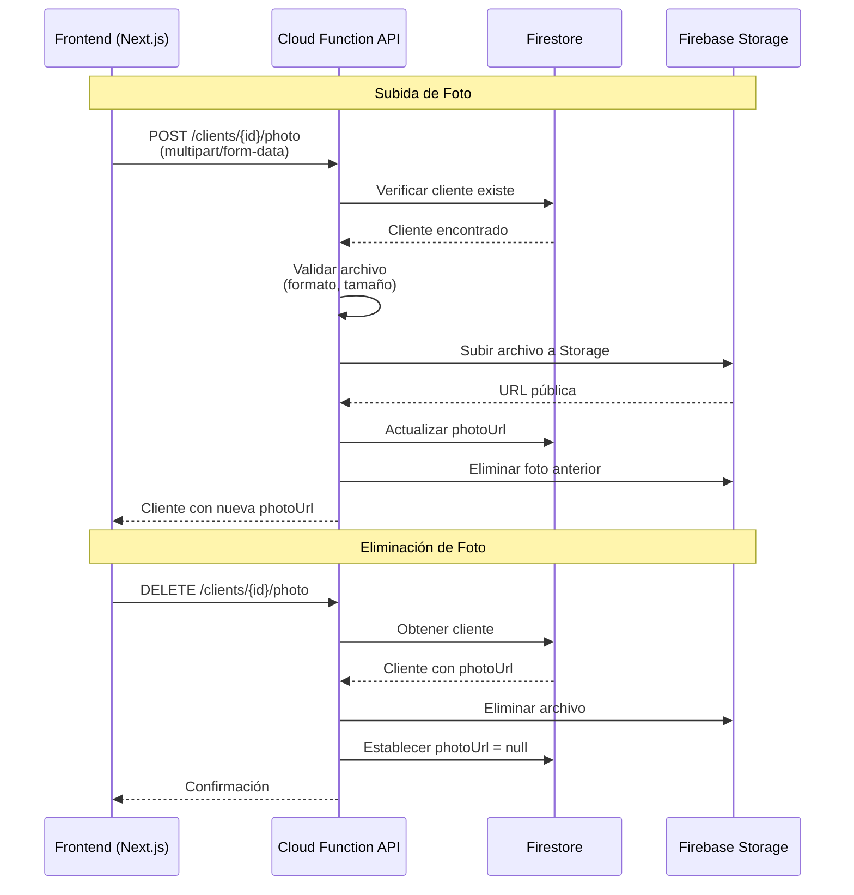

# Especificación Técnica: Fotos de Perfil de Clientes

## 1. Resumen Ejecutivo

Esta especificación define la funcionalidad de fotos de perfil para clientes en LoyaltyGen. La característica permite a los usuarios subir, actualizar y eliminar fotos de perfil opcionales para cada cliente, mejorando la experiencia visual y facilitando la identificación de clientes.

## 2. Objetivos

1. **Permitir la gestión de fotos de perfil** de forma opcional sin impactar el flujo existente de creación de clientes
2. **Almacenar fotos de manera eficiente** usando Firebase Storage en lugar de Firestore
3. **Proporcionar una experiencia de usuario fluida** con placeholders cuando no hay foto
4. **Garantizar seguridad y cumplimiento** de políticas de PII (Personally Identifiable Information)
5. **Optimizar rendimiento** mediante URLs públicas servidas por Google Cloud CDN

## 3. Arquitectura de la Solución

### 3.1. Diagrama de Flujo



### 3.2. Modelo de Datos

#### Campo en Firestore

```typescript
interface Client {
  id: string;
  name: ClientName;
  email: string | null;
  identity_document: IdentityDocument | null;
  photoUrl: string | null;  // ← NUEVO CAMPO
  phones: Phone[];
  addresses: Address[];
  extra_data: Record<string, unknown>;
  affinityGroupIds: string[];
  account_balances: Record<string, number>;
  created_at: Timestamp;
  updated_at: Timestamp;
}
```

#### Estructura en Firebase Storage

```
/client-photos/
  ├── {clientId_1}/
  │   ├── 1702234567890_profile.jpg
  │   └── 1702234890123_photo.png  (foto más reciente)
  ├── {clientId_2}/
  │   └── 1702235123456_image.webp
  └── {clientId_3}/
      └── 1702235456789_avatar.jpg
```

**Convenciones de Nomenclatura:**
- Directorio por cliente: `/client-photos/{clientId}/`
- Formato de archivo: `{timestamp}_{nombre_sanitizado}.{ext}`
- Timestamp en milisegundos para evitar colisiones

## 4. API Endpoints

### 4.1. Subir/Actualizar Foto de Perfil

**Endpoint:** `POST /api/v1/clients/{client_id}/photo`

**Autenticación:** Requerida (Bearer token)

**Content-Type:** `multipart/form-data`

**Request Body:**
```
photo: [binary data]  // Campo del formulario con el archivo
```

**Validaciones:**
- **Formatos permitidos:** `image/jpeg`, `image/png`, `image/webp`
- **Tamaño máximo:** 5 MB (5,242,880 bytes)
- **Validación de tipo MIME:** Se verifica el tipo MIME real, no solo la extensión

**Response (200 OK):**
```json
{
  "id": "client-123",
  "name": {
    "firstName": "Juan",
    "secondName": null,
    "firstLastName": "Pérez",
    "secondLastName": null
  },
  "email": "juan.perez@example.com",
  "photoUrl": "https://storage.googleapis.com/project-id.appspot.com/client-photos/client-123/1702234567890_profile.jpg",
  "phones": [],
  "addresses": [],
  "extra_data": {},
  "affinityGroupIds": [],
  "account_balances": {},
  "created_at": "2024-01-15T10:30:00.000Z",
  "updated_at": "2024-01-15T12:45:00.000Z"
}
```

**Errores:**

| Código | Descripción | HTTP Status |
|--------|-------------|-------------|
| `MISSING_FILE` | No se proporcionó archivo en la petición | 400 |
| `INVALID_FILE_FORMAT` | Formato de archivo no soportado | 400 |
| `FILE_TOO_LARGE` | El archivo excede el tamaño máximo de 5 MB | 400 |
| `RESOURCE_NOT_FOUND` | El cliente con el ID proporcionado no existe | 404 |
| `INVALID_TOKEN` | Token de autenticación inválido o expirado | 401 |

**Comportamiento:**
1. Verifica que el cliente exista
2. Valida el archivo recibido (formato y tamaño)
3. Sube el nuevo archivo a Firebase Storage
4. Actualiza el campo `photoUrl` en Firestore
5. **Limpieza:** Elimina la foto anterior de Storage (si existía)
6. Retorna el cliente actualizado

### 4.2. Eliminar Foto de Perfil

**Endpoint:** `DELETE /api/v1/clients/{client_id}/photo`

**Autenticación:** Requerida (Bearer token)

**Response (200 OK):**
```json
{
  "message": "Foto de perfil eliminada exitosamente."
}
```

**Comportamiento:**
1. Verifica que el cliente exista
2. Si el cliente tiene `photoUrl`:
   - Elimina el archivo de Firebase Storage
   - Establece `photoUrl = null` en Firestore
3. Si el cliente no tiene foto, retorna éxito de todas formas (idempotente)

## 5. Implementación Backend

### 5.1. PhotoService

El servicio `PhotoService` encapsula toda la lógica de interacción con Firebase Storage:

**Métodos principales:**

```typescript
class PhotoService {
  // Sube una foto y retorna la URL pública
  async uploadPhoto(
    clientId: string,
    fileBuffer: Buffer,
    mimeType: string,
    originalName: string
  ): Promise<string>
  
  // Elimina una foto dado su URL
  async deletePhoto(photoUrl: string): Promise<void>
  
  // Elimina todas las fotos de un cliente (limpieza)
  async deleteAllClientPhotos(clientId: string): Promise<void>
}
```

**Validaciones implementadas:**
- Lista blanca de tipos MIME permitidos
- Verificación de tamaño de archivo
- Sanitización del nombre de archivo
- Manejo de errores de Storage

### 5.2. Integración con ClientService

El `ClientService` debe limpiarse para eliminar fotos al borrar un cliente:

```typescript
async delete(id: string): Promise<void> {
  const doc = await clientsCollection.doc(id).get();
  
  if (!doc.exists) {
    throw new NotFoundError('Cliente', id);
  }
  
  const clientData = doc.data();
  
  // Limpieza de foto
  if (clientData?.photoUrl) {
    await this.photoService.deletePhoto(clientData.photoUrl);
  }
  
  // Limpieza adicional por si hay fotos huérfanas
  await this.photoService.deleteAllClientPhotos(id);
  
  await clientsCollection.doc(id).delete();
}
```

## 6. Implementación Frontend

### 6.1. Componente Avatar

**Ubicación sugerida:** `components/ui/client-avatar.tsx`

**Funcionalidad:**
- Muestra la foto del cliente si existe `photoUrl`
- Muestra placeholder con iniciales si no hay foto
- Soporta diferentes tamaños (sm, md, lg)
- Color de fondo basado en las iniciales para consistencia

**Ejemplo de implementación:**

```tsx
import { cn } from "@/lib/utils";
import Image from "next/image";

interface ClientAvatarProps {
  client: {
    name: {
      firstName: string;
      firstLastName: string;
    };
    photoUrl?: string | null;
  };
  size?: "sm" | "md" | "lg";
  className?: string;
}

export function ClientAvatar({ client, size = "md", className }: ClientAvatarProps) {
  const initials = `${client.name.firstName[0]}${client.name.firstLastName[0]}`.toUpperCase();
  
  // Generar color consistente basado en las iniciales
  const colorIndex = (initials.charCodeAt(0) + initials.charCodeAt(1)) % 6;
  const colors = [
    "bg-blue-600",
    "bg-green-600",
    "bg-purple-600",
    "bg-pink-600",
    "bg-indigo-600",
    "bg-teal-600"
  ];
  
  const sizes = {
    sm: "h-8 w-8 text-xs",
    md: "h-12 w-12 text-sm",
    lg: "h-16 w-16 text-base"
  };
  
  if (client.photoUrl) {
    return (
      <div className={cn("relative rounded-full overflow-hidden", sizes[size], className)}>
        <Image
          src={client.photoUrl}
          alt={`${client.name.firstName} ${client.name.firstLastName}`}
          fill
          className="object-cover"
        />
      </div>
    );
  }
  
  return (
    <div
      className={cn(
        "rounded-full flex items-center justify-center text-white font-semibold",
        sizes[size],
        colors[colorIndex],
        className
      )}
    >
      {initials}
    </div>
  );
}
```

### 6.2. Formulario de Subida de Foto

**Ubicación sugerida:** `components/clients/photo-upload-form.tsx`

**Funcionalidades:**
- Selector de archivos con validación del lado del cliente
- Preview de la imagen antes de subir
- Indicador de progreso durante la subida
- Manejo de errores con mensajes claros
- Botón para eliminar foto existente

**Validaciones del lado del cliente:**
```typescript
const MAX_FILE_SIZE = 5 * 1024 * 1024; // 5 MB
const ALLOWED_TYPES = ['image/jpeg', 'image/png', 'image/webp'];

function validateFile(file: File): string | null {
  if (!ALLOWED_TYPES.includes(file.type)) {
    return 'Formato de archivo no válido. Use JPEG, PNG o WEBP.';
  }
  
  if (file.size > MAX_FILE_SIZE) {
    return 'El archivo es demasiado grande. El tamaño máximo es 5 MB.';
  }
  
  return null;
}
```

### 6.3. Integración con Formularios de Cliente

**Crear Cliente:**
- El campo `photoUrl` es opcional en creación
- Se puede omitir completamente (el cliente se crea sin foto)
- Opcionalmente, incluir un paso para subir foto después de crear el cliente

**Editar Cliente:**
- Mostrar foto actual o placeholder
- Botón "Cambiar Foto" abre selector de archivos
- Botón "Eliminar Foto" con confirmación

**Vista de Detalle:**
- Mostrar avatar prominente en la parte superior
- Indicador visual si no hay foto
- Acción rápida para añadir/cambiar foto

## 7. Seguridad

### 7.1. Autenticación y Autorización

**Requisitos:**
- Todos los endpoints de foto requieren autenticación válida (Bearer token)
- Solo usuarios con permisos sobre el cliente pueden gestionar su foto
- Las reglas de Firebase Storage deben validar autenticación

### 7.2. Reglas de Firebase Storage

```javascript
rules_version = '2';
service firebase.storage {
  match /b/{bucket}/o {
    // Fotos de perfil de clientes
    match /client-photos/{clientId}/{fileName} {
      // Permitir lectura pública (las URLs son opacas con el ID del cliente)
      allow read: if true;
      
      // Permitir escritura solo a usuarios autenticados
      allow write: if request.auth != null;
      
      // Validar tamaño y tipo de archivo
      allow create: if request.auth != null
                   && request.resource.size <= 5 * 1024 * 1024  // 5 MB
                   && request.resource.contentType.matches('image/(jpeg|png|webp)');
      
      // Permitir eliminación solo a usuarios autenticados
      allow delete: if request.auth != null;
    }
  }
}
```

### 7.3. Políticas de PII

**Información Personal Identificable:**
- Las fotos de perfil contienen PII visual
- **Regla crítica:** Las URLs de fotos NO deben registrarse en logs
- Usar referencias opacas en logs (ej: "photo exists: true")

**Logging seguro:**
```typescript
// ❌ INCORRECTO
console.log(`Foto subida: ${photoUrl}`);

// ✅ CORRECTO
console.log(`Foto subida exitosamente para cliente: ${clientId}`);
```

## 8. Optimizaciones (Post-MVP)

### 8.1. Generación Automática de Thumbnails

**Extensión de Firebase:** [Resize Images](https://firebase.google.com/products/extensions/firebase-resize-images)

**Configuración sugerida:**
- Original: 1024x1024 (máximo)
- Thumbnail: 256x256 (para listas)
- Avatar: 128x128 (para avatares pequeños)

**Beneficios:**
- Reduce ancho de banda
- Mejora tiempo de carga en listas
- Optimiza experiencia móvil

### 8.2. Compresión del Lado del Cliente

**Librería sugerida:** [browser-image-compression](https://www.npmjs.com/package/browser-image-compression)

**Configuración recomendada:**
```typescript
const options = {
  maxSizeMB: 1,
  maxWidthOrHeight: 1024,
  useWebWorker: true
};
```

### 8.3. CDN y Caché

**Por defecto:**
- Firebase Storage sirve archivos a través de Google Cloud CDN
- Caché automático en edge locations
- Latencia reducida para usuarios globales

**Headers de caché sugeridos:**
```typescript
metadata: {
  cacheControl: 'public, max-age=31536000' // 1 año
}
```

### 8.4. Detección de Contenido Inapropiado

**Integración con Cloud Vision API:**
- Safe Search Detection para contenido adulto
- Detección de violencia o contenido ofensivo
- Rechazo automático de imágenes inapropiadas

**Implementación Post-MVP:**
```typescript
import vision from '@google-cloud/vision';

async function validateImageContent(fileBuffer: Buffer): Promise<boolean> {
  const client = new vision.ImageAnnotatorClient();
  const [result] = await client.safeSearchDetection(fileBuffer);
  const detections = result.safeSearchAnnotation;
  
  // Rechazar si hay contenido adulto o violento
  return detections.adult !== 'LIKELY' && detections.adult !== 'VERY_LIKELY'
      && detections.violence !== 'LIKELY' && detections.violence !== 'VERY_LIKELY';
}
```

## 9. Testing

### 9.1. Tests Unitarios

**PhotoService:**
- ✅ Sube foto con formato válido
- ✅ Rechaza formato inválido
- ✅ Rechaza archivo mayor a 5 MB
- ✅ Genera URL pública correcta
- ✅ Elimina foto existente
- ✅ Maneja errores de Storage gracefully

**ClientService:**
- ✅ Elimina foto al borrar cliente
- ✅ Limpia fotos huérfanas

### 9.2. Tests de Integración

**API Endpoints:**
- ✅ `POST /clients/{id}/photo` sube foto correctamente
- ✅ `POST /clients/{id}/photo` valida autenticación
- ✅ `POST /clients/{id}/photo` retorna 404 para cliente inexistente
- ✅ `POST /clients/{id}/photo` retorna 400 para archivo inválido
- ✅ `DELETE /clients/{id}/photo` elimina foto correctamente
- ✅ `DELETE /clients/{id}/photo` es idempotente

### 9.3. Tests E2E

**Flujo completo:**
1. Crear cliente sin foto
2. Subir foto de perfil
3. Verificar que la foto se muestra en la UI
4. Actualizar foto (reemplazar)
5. Verificar que la foto anterior fue eliminada
6. Eliminar foto explícitamente
7. Verificar placeholder se muestra
8. Eliminar cliente
9. Verificar que la foto fue eliminada de Storage

## 10. Monitoreo y Métricas

### 10.1. Métricas Clave

**Storage:**
- Tamaño total de fotos almacenadas
- Número de fotos por cliente (debería ser ≤ 1)
- Tasa de crecimiento de Storage

**API:**
- Latencia de subida de fotos (p50, p95, p99)
- Tasa de éxito/fallo de subidas
- Errores de validación (por tipo)

**Uso:**
- % de clientes con foto
- Operaciones de foto por día/semana/mes

### 10.2. Alertas

**Configurar alertas para:**
- Tasa de error > 5% en endpoints de foto
- Latencia p95 > 5 segundos
- Uso de Storage > 80% de cuota

## 11. Migraciones y Retrocompatibilidad

### 11.1. Migración de Datos Existentes

**Si hay clientes existentes sin campo `photoUrl`:**

```typescript
// Script de migración (ejecutar una vez)
async function migrateExistingClients() {
  const batch = db.batch();
  const clientsSnapshot = await db.collection('clients')
    .where('photoUrl', '==', undefined)
    .get();
  
  clientsSnapshot.forEach(doc => {
    batch.update(doc.ref, { photoUrl: null });
  });
  
  await batch.commit();
  console.log(`Migrados ${clientsSnapshot.size} clientes`);
}
```

### 11.2. Retrocompatibilidad

**El campo `photoUrl` es opcional:**
- La aplicación funciona sin cambios si no hay fotos
- Los placeholders se muestran automáticamente
- No se requiere actualización de clientes existentes

## 12. Checklist de Implementación

### Backend
- [ ] Actualizar schema Zod para incluir `photoUrl`
- [ ] Crear `PhotoService` con métodos de upload/delete
- [ ] Crear rutas `POST /clients/{id}/photo` y `DELETE /clients/{id}/photo`
- [ ] Integrar eliminación de fotos en `ClientService.delete()`
- [ ] Configurar reglas de Firebase Storage
- [ ] Añadir validaciones de formato y tamaño
- [ ] Implementar manejo de errores
- [ ] Escribir tests unitarios y de integración

### Frontend
- [ ] Crear componente `ClientAvatar` con placeholder
- [ ] Crear formulario de subida de foto
- [ ] Integrar subida de foto en formulario de edición
- [ ] Añadir preview de imagen antes de subir
- [ ] Implementar validación del lado del cliente
- [ ] Añadir estados de carga y error
- [ ] Implementar eliminación de foto con confirmación
- [ ] Actualizar todas las vistas de cliente para mostrar avatar

### Documentación
- [x] Actualizar OpenAPI con endpoints de foto
- [x] Documentar modelo de datos en ARCHITECTURE.md
- [x] Especificar en CLIENT-FIELDS-SPEC.md
- [x] Definir UX en UI-UX-GUIDELINES.md
- [x] Añadir tareas en WORK-PLAN.md
- [x] Crear documento técnico completo (este documento)

### Testing
- [ ] Tests unitarios de PhotoService
- [ ] Tests de integración de endpoints
- [ ] Tests E2E de flujo completo
- [ ] Validación manual de subida/eliminación
- [ ] Validación de placeholders en UI

### Despliegue
- [ ] Configurar reglas de Storage en Firebase Console
- [ ] Verificar cuotas de Storage
- [ ] Desplegar Cloud Functions actualizadas
- [ ] Desplegar frontend actualizado
- [ ] Ejecutar migración de datos (si necesario)
- [ ] Verificar en producción

---

## Contacto y Soporte

Para preguntas sobre esta especificación o la implementación de la característica de fotos de perfil, contacte al equipo de desarrollo o consulte los documentos de referencia en el directorio `/docs`.

**Documentos relacionados:**
- `openapi.yaml` - Especificación completa de la API
- `docs/ARCHITECTURE.md` - Arquitectura del sistema
- `docs/CLIENT-FIELDS-SPEC.md` - Especificación de campos del cliente
- `docs/UI-UX-GUIDELINES.md` - Guías de experiencia de usuario
- `WORK-PLAN.md` - Plan de implementación detallado
