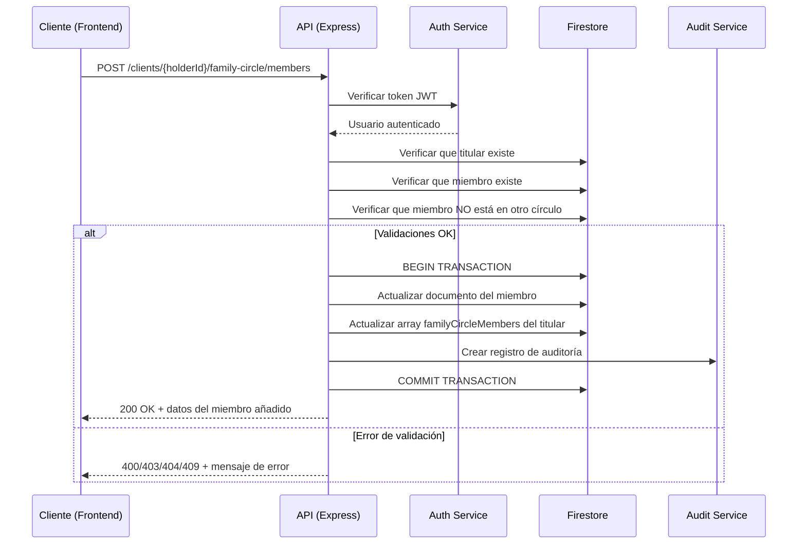
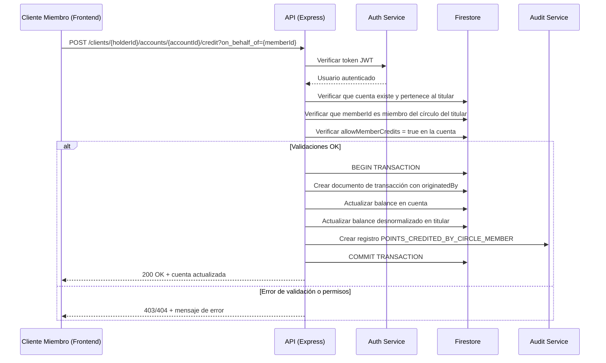

# FAMILY-GROUP-API-SPEC.md - Especificación de API para Círculos de Afinidad Familiares

## 1. Endpoints Nuevos

Esta sección detalla los nuevos endpoints que deben implementarse para soportar la funcionalidad de círculos de afinidad familiares.

---

### 1.1. Añadir Miembro al Círculo Familiar

**Endpoint:** `POST /clients/{client_id}/family-circle/members`

**Descripción:** Añade un cliente existente como miembro del círculo de afinidad del cliente titular especificado.

**Autenticación:** Requerida (Bearer Token)

**Autorización:** Solo el titular autenticado puede añadir miembros a su propio círculo.

#### Request

**Path Parameters:**
- `client_id` (string, required): ID del cliente titular del círculo.

**Request Body:**
```json
{
  "memberId": "client-id-123",
  "relationshipType": "child"
}
```

**Schema:**
```typescript
{
  memberId: string;       // ID del cliente a añadir como miembro
  relationshipType: 'spouse' | 'child' | 'parent' | 'sibling' | 'friend' | 'other';
}
```

#### Response

**Success (200 OK):**
```json
{
  "message": "Member added to family circle successfully",
  "member": {
    "memberId": "client-id-123",
    "relationshipType": "child",
    "addedAt": "2025-12-08T12:00:00.000Z",
    "addedBy": "user-uid-456"
  }
}
```

**Error Responses:**

| Status Code | Error Code | Descripción |
|-------------|------------|-------------|
| 400 | `CANNOT_ADD_SELF` | El titular no puede añadirse a sí mismo |
| 400 | `INVALID_RELATIONSHIP_TYPE` | El tipo de relación no es válido |
| 403 | `NOT_CIRCLE_HOLDER` | Solo el titular puede añadir miembros |
| 404 | `CLIENT_NOT_FOUND` | El cliente titular o el miembro no existe |
| 409 | `MEMBER_ALREADY_IN_CIRCLE` | El cliente ya es miembro de otro círculo |

**Ejemplo de Error:**
```json
{
  "error": {
    "code": "MEMBER_ALREADY_IN_CIRCLE",
    "message": "The client is already a member of another family circle and must be removed first."
  }
}
```

---

### 1.2. Remover Miembro del Círculo Familiar

**Endpoint:** `DELETE /clients/{client_id}/family-circle/members/{member_id}`

**Descripción:** Remueve un cliente del círculo de afinidad del titular especificado.

**Autenticación:** Requerida (Bearer Token)

**Autorización:** Solo el titular autenticado puede remover miembros de su propio círculo.

#### Request

**Path Parameters:**
- `client_id` (string, required): ID del cliente titular del círculo.
- `member_id` (string, required): ID del cliente miembro a remover.

**Request Body:** Ninguno

#### Response

**Success (200 OK):**
```json
{
  "message": "Member removed from family circle successfully"
}
```

**Error Responses:**

| Status Code | Error Code | Descripción |
|-------------|------------|-------------|
| 403 | `NOT_CIRCLE_HOLDER` | Solo el titular puede remover miembros |
| 404 | `CLIENT_NOT_FOUND` | El cliente titular o el miembro no existe |
| 404 | `MEMBER_NOT_IN_CIRCLE` | El cliente no es miembro del círculo especificado |

---

### 1.3. Listar Miembros del Círculo Familiar

**Endpoint:** `GET /clients/{client_id}/family-circle/members`

**Descripción:** Obtiene la lista de todos los miembros del círculo de afinidad del cliente titular.

**Autenticación:** Requerida (Bearer Token)

**Autorización:** Solo el titular autenticado puede ver los miembros de su propio círculo.

#### Request

**Path Parameters:**
- `client_id` (string, required): ID del cliente titular del círculo.

**Query Parameters:** Ninguno

#### Response

**Success (200 OK):**
```json
{
  "data": [
    {
      "memberId": "client-id-123",
      "memberName": "Ana García",
      "memberEmail": "ana@example.com",
      "relationshipType": "child",
      "addedAt": "2025-12-08T12:00:00.000Z",
      "addedBy": "user-uid-456"
    },
    {
      "memberId": "client-id-124",
      "memberName": "Juan García",
      "memberEmail": "juan@example.com",
      "relationshipType": "spouse",
      "addedAt": "2025-12-07T10:30:00.000Z",
      "addedBy": "user-uid-456"
    }
  ],
  "metadata": {
    "totalMembers": 2,
    "holder": {
      "clientId": "client-id-100",
      "clientName": "María García"
    }
  }
}
```

**Error Responses:**

| Status Code | Error Code | Descripción |
|-------------|------------|-------------|
| 403 | `NOT_CIRCLE_HOLDER` | Solo el titular puede ver los miembros |
| 404 | `CLIENT_NOT_FOUND` | El cliente titular no existe |
| 404 | `NO_FAMILY_CIRCLE` | El cliente no tiene un círculo familiar |

---

### 1.4. Obtener Información del Círculo de un Cliente

**Endpoint:** `GET /clients/{client_id}/family-circle`

**Descripción:** Obtiene información sobre el círculo de afinidad del cliente (ya sea como titular o como miembro).

**Autenticación:** Requerida (Bearer Token)

**Autorización:** El cliente autenticado puede ver su propia información de círculo.

#### Request

**Path Parameters:**
- `client_id` (string, required): ID del cliente.

#### Response

**Success (200 OK) - Cliente es Titular:**
```json
{
  "role": "holder",
  "members": [
    {
      "memberId": "client-id-123",
      "memberName": "Ana García",
      "relationshipType": "child",
      "addedAt": "2025-12-08T12:00:00.000Z"
    }
  ],
  "totalMembers": 1
}
```

**Success (200 OK) - Cliente es Miembro:**
```json
{
  "role": "member",
  "holderId": "client-id-100",
  "holderName": "María García",
  "relationshipType": "child",
  "joinedAt": "2025-12-08T12:00:00.000Z"
}
```

**Success (200 OK) - Cliente sin Círculo:**
```json
{
  "role": null,
  "message": "Client is not part of any family circle"
}
```

---

### 1.5. Actualizar Configuración de Círculo en Cuenta

**Endpoint:** `PATCH /clients/{client_id}/accounts/{account_id}/family-circle-config`

**Descripción:** Actualiza la configuración de permisos de círculo familiar para una cuenta de lealtad específica.

**Autenticación:** Requerida (Bearer Token)

**Autorización:** Solo el titular de la cuenta puede modificar la configuración.

#### Request

**Path Parameters:**
- `client_id` (string, required): ID del cliente titular de la cuenta.
- `account_id` (string, required): ID de la cuenta de lealtad.

**Request Body:**
```json
{
  "allowMemberCredits": true,
  "allowMemberDebits": false
}
```

**Schema:**
```typescript
{
  allowMemberCredits?: boolean;   // Opcional: permite créditos de miembros
  allowMemberDebits?: boolean;    // Opcional: permite débitos de miembros
}
```

**Validación:** Al menos uno de los campos debe estar presente.

#### Response

**Success (200 OK):**
```json
{
  "message": "Family circle configuration updated successfully",
  "config": {
    "allowMemberCredits": true,
    "allowMemberDebits": false,
    "updatedAt": "2025-12-08T12:30:00.000Z",
    "updatedBy": "user-uid-456"
  }
}
```

**Error Responses:**

| Status Code | Error Code | Descripción |
|-------------|------------|-------------|
| 400 | `NO_FIELDS_PROVIDED` | No se proporcionó ningún campo para actualizar |
| 403 | `NOT_ACCOUNT_OWNER` | Solo el dueño de la cuenta puede modificar la config |
| 404 | `ACCOUNT_NOT_FOUND` | La cuenta especificada no existe |

---

### 1.6. Obtener Configuración de Círculo de una Cuenta

**Endpoint:** `GET /clients/{client_id}/accounts/{account_id}/family-circle-config`

**Descripción:** Obtiene la configuración actual de permisos de círculo familiar para una cuenta.

**Autenticación:** Requerida (Bearer Token)

**Autorización:** El titular o miembros del círculo pueden consultar la configuración.

#### Request

**Path Parameters:**
- `client_id` (string, required): ID del cliente titular de la cuenta.
- `account_id` (string, required): ID de la cuenta de lealtad.

#### Response

**Success (200 OK):**
```json
{
  "allowMemberCredits": true,
  "allowMemberDebits": false,
  "updatedAt": "2025-12-08T12:30:00.000Z",
  "updatedBy": "user-uid-456"
}
```

**Success (200 OK) - Sin Configuración:**
```json
{
  "allowMemberCredits": true,
  "allowMemberDebits": false,
  "message": "Using default configuration"
}
```

---

## 2. Endpoints Modificados

Los siguientes endpoints existentes deben modificarse para soportar transacciones originadas por miembros del círculo.

---

### 2.1. Acreditar Puntos (Modificado)

**Endpoint:** `POST /clients/{client_id}/accounts/{account_id}/credit`

**Cambios:**

1. **Nuevo Query Parameter (Opcional):**
   - `on_behalf_of` (string, optional): ID del cliente miembro que origina la transacción.

2. **Validación Adicional:**
   - Si `on_behalf_of` está presente:
     - Verificar que el cliente especificado sea miembro del círculo del titular
     - Verificar que `allowMemberCredits = true` en la cuenta
     - El usuario autenticado debe ser el miembro o tener permisos de admin

3. **Modificación en la Transacción:**
   - Incluir campo `originatedBy` en el documento de transacción
   - Registrar auditoría con acción `POINTS_CREDITED_BY_CIRCLE_MEMBER` si aplica

#### Request Actualizado

**Path Parameters:** (sin cambios)
- `client_id` (string, required): ID del cliente titular de la cuenta.
- `account_id` (string, required): ID de la cuenta de lealtad.

**Query Parameters:**
- `on_behalf_of` (string, optional): ID del cliente miembro que origina la transacción.

**Request Body:** (sin cambios)
```json
{
  "amount": 100,
  "description": "Compra en supermercado"
}
```

#### Response Actualizada

**Success (200 OK):**
```json
{
  "id": "account-id-123",
  "account_name": "Puntos SuperMarket",
  "points": 1100,
  "created_at": "2025-01-01T10:00:00.000Z",
  "updated_at": "2025-12-08T12:40:00.000Z",
  "originatedBy": {
    "clientId": "client-id-123",
    "clientName": "Ana García",
    "isCircleMember": true,
    "relationshipType": "child"
  }
}
```

**Nuevos Errores:**

| Status Code | Error Code | Descripción |
|-------------|------------|-------------|
| 403 | `CIRCLE_CREDITS_NOT_ALLOWED` | La cuenta no permite créditos de miembros |
| 404 | `MEMBER_NOT_IN_CIRCLE` | El cliente no es miembro del círculo |
| 403 | `UNAUTHORIZED_MEMBER_ACTION` | El usuario autenticado no puede actuar en nombre de este miembro |

---

### 2.2. Debitar Puntos (Modificado)

**Endpoint:** `POST /clients/{client_id}/accounts/{account_id}/debit`

**Cambios:** Idénticos a los de crédito, pero validando `allowMemberDebits` en lugar de `allowMemberCredits`.

#### Request Actualizado

**Query Parameters:**
- `on_behalf_of` (string, optional): ID del cliente miembro que origina la transacción.

**Request Body:** (sin cambios)
```json
{
  "amount": 50,
  "description": "Canje de producto"
}
```

#### Response Actualizada

Similar a la de crédito, incluyendo campo `originatedBy` si aplica.

**Nuevos Errores:**

| Status Code | Error Code | Descripción |
|-------------|------------|-------------|
| 403 | `CIRCLE_DEBITS_NOT_ALLOWED` | La cuenta no permite débitos de miembros |
| 404 | `MEMBER_NOT_IN_CIRCLE` | El cliente no es miembro del círculo |
| 403 | `UNAUTHORIZED_MEMBER_ACTION` | El usuario autenticado no puede actuar en nombre de este miembro |

---

### 2.3. Listar Transacciones (Modificado)

**Endpoint:** `GET /clients/{client_id}/accounts/{account_id}/transactions`

**Cambios:**

1. **Nuevo Query Parameter (Opcional):**
   - `originated_by` (string, optional): Filtrar por ID del cliente que originó las transacciones.
   - `circle_members_only` (boolean, optional): Si es `true`, solo devuelve transacciones originadas por miembros del círculo.

2. **Modificación en la Respuesta:**
   - Incluir campo `originatedBy` en cada transacción si aplica.

#### Request Actualizado

**Query Parameters:**
- `limit` (integer, optional): Número máximo de transacciones a devolver (default: 50, max: 100).
- `next_cursor` (string, optional): Cursor para paginación.
- `originated_by` (string, optional): Filtrar por ID del cliente originador.
- `circle_members_only` (boolean, optional): Solo transacciones de miembros del círculo.

#### Response Actualizada

**Success (200 OK):**
```json
{
  "data": [
    {
      "id": "tx-id-789",
      "transaction_type": "credit",
      "amount": 100,
      "description": "Compra en supermercado",
      "timestamp": "2025-12-08T12:40:00.000Z",
      "originatedBy": {
        "clientId": "client-id-123",
        "isCircleMember": true,
        "relationshipType": "child"
      }
    },
    {
      "id": "tx-id-788",
      "transaction_type": "debit",
      "amount": 50,
      "description": "Canje de producto",
      "timestamp": "2025-12-07T15:20:00.000Z",
      "originatedBy": null
    }
  ],
  "paging": {
    "next_cursor": "cursor-xyz"
  }
}
```

---

### 2.4. Obtener Cliente (Modificado)

**Endpoint:** `GET /clients/{client_id}`

**Cambios:**

1. **Campos Adicionales en la Respuesta:**
   - Incluir información del círculo familiar (`familyCircle` y `familyCircleMembers`).

#### Response Actualizada

**Success (200 OK) - Cliente Titular:**
```json
{
  "id": "client-id-100",
  "name": {
    "firstName": "María",
    "secondName": null,
    "firstLastName": "García",
    "secondLastName": "López"
  },
  "email": "maria@example.com",
  "familyCircle": {
    "role": "holder",
    "holderId": null,
    "relationshipType": null,
    "joinedAt": null
  },
  "familyCircleMembers": [
    {
      "memberId": "client-id-123",
      "relationshipType": "child",
      "addedAt": "2025-12-08T12:00:00.000Z",
      "addedBy": "user-uid-456"
    }
  ],
  "account_balances": {
    "account-id-1": 1000
  },
  "created_at": "2025-01-01T10:00:00.000Z",
  "updated_at": "2025-12-08T12:00:00.000Z"
}
```

**Success (200 OK) - Cliente Miembro:**
```json
{
  "id": "client-id-123",
  "name": {
    "firstName": "Ana",
    "secondName": null,
    "firstLastName": "García",
    "secondLastName": "López"
  },
  "email": "ana@example.com",
  "familyCircle": {
    "role": "member",
    "holderId": "client-id-100",
    "relationshipType": "child",
    "joinedAt": "2025-12-08T12:00:00.000Z"
  },
  "familyCircleMembers": null,
  "account_balances": {},
  "created_at": "2025-01-02T14:30:00.000Z",
  "updated_at": "2025-12-08T12:00:00.000Z"
}
```

---

## 3. Schemas de Zod

A continuación, se definen los schemas de Zod que deben implementarse para validar las peticiones.

### 3.1. Schema de Tipos de Relación

```typescript
export const relationshipTypeSchema = z.enum([
  'spouse',
  'child',
  'parent',
  'sibling',
  'friend',
  'other'
], {
  errorMap: () => ({ message: "Invalid relationship type" })
});

export type RelationshipType = z.infer<typeof relationshipTypeSchema>;
```

### 3.2. Schema para Añadir Miembro

```typescript
export const addFamilyCircleMemberSchema = z.object({
  memberId: z.string()
    .min(1, "Member ID is required")
    .regex(/^[a-zA-Z0-9_-]+$/, "Member ID contains invalid characters"),
  relationshipType: relationshipTypeSchema
});

export type AddFamilyCircleMemberInput = z.infer<typeof addFamilyCircleMemberSchema>;
```

### 3.3. Schema para Configuración de Cuenta

```typescript
export const updateFamilyCircleConfigSchema = z.object({
  allowMemberCredits: z.boolean().optional(),
  allowMemberDebits: z.boolean().optional()
}).refine(
  data => data.allowMemberCredits !== undefined || data.allowMemberDebits !== undefined,
  {
    message: "At least one configuration field must be provided"
  }
);

export type UpdateFamilyCircleConfigInput = z.infer<typeof updateFamilyCircleConfigSchema>;
```

### 3.4. Schema de Círculo Familiar (Cliente)

```typescript
export const familyCircleSchema = z.object({
  role: z.enum(['holder', 'member']).nullable(),
  holderId: z.string().nullable(),
  relationshipType: relationshipTypeSchema.nullable(),
  joinedAt: z.date().nullable()
}).nullable();

export type FamilyCircle = z.infer<typeof familyCircleSchema>;
```

### 3.5. Schema de Miembro del Círculo

```typescript
export const familyCircleMemberSchema = z.object({
  memberId: z.string(),
  relationshipType: relationshipTypeSchema,
  addedAt: z.date(),
  addedBy: z.string()
});

export type FamilyCircleMember = z.infer<typeof familyCircleMemberSchema>;
```

### 3.6. Schema de Configuración de Cuenta

```typescript
export const familyCircleAccountConfigSchema = z.object({
  allowMemberCredits: z.boolean(),
  allowMemberDebits: z.boolean(),
  updatedAt: z.date(),
  updatedBy: z.string()
}).nullable();

export type FamilyCircleAccountConfig = z.infer<typeof familyCircleAccountConfigSchema>;
```

### 3.7. Schema de Originador de Transacción

```typescript
export const transactionOriginatorSchema = z.object({
  clientId: z.string(),
  isCircleMember: z.boolean(),
  relationshipType: relationshipTypeSchema.nullable()
}).nullable();

export type TransactionOriginator = z.infer<typeof transactionOriginatorSchema>;
```

---

## 4. Estructura de Rutas Express

Organización sugerida de las rutas en el proyecto:

```
functions/src/api/routes/
├── clients.routes.ts              (rutas existentes de clientes)
├── familyCircle.routes.ts         (nuevas rutas para círculo familiar)
└── accounts.routes.ts             (rutas existentes de cuentas, modificadas)
```

### 4.1. Rutas de Círculo Familiar

```typescript
// familyCircle.routes.ts
import { Router } from 'express';
import { authMiddleware } from '../middleware/auth.middleware';
import { validateRequest } from '../middleware/validation.middleware';
import * as familyCircleController from '../controllers/familyCircle.controller';
import { 
  addFamilyCircleMemberSchema, 
  updateFamilyCircleConfigSchema 
} from '../../schemas/familyCircle.schema';

const router = Router();

// Todas las rutas requieren autenticación
router.use(authMiddleware);

// Obtener información del círculo
router.get(
  '/clients/:clientId/family-circle',
  familyCircleController.getFamilyCircleInfo
);

// Listar miembros del círculo
router.get(
  '/clients/:clientId/family-circle/members',
  familyCircleController.listFamilyCircleMembers
);

// Añadir miembro al círculo
router.post(
  '/clients/:clientId/family-circle/members',
  validateRequest(addFamilyCircleMemberSchema),
  familyCircleController.addFamilyCircleMember
);

// Remover miembro del círculo
router.delete(
  '/clients/:clientId/family-circle/members/:memberId',
  familyCircleController.removeFamilyCircleMember
);

// Obtener configuración de cuenta
router.get(
  '/clients/:clientId/accounts/:accountId/family-circle-config',
  familyCircleController.getFamilyCircleAccountConfig
);

// Actualizar configuración de cuenta
router.patch(
  '/clients/:clientId/accounts/:accountId/family-circle-config',
  validateRequest(updateFamilyCircleConfigSchema),
  familyCircleController.updateFamilyCircleAccountConfig
);

export default router;
```

---

## 5. Flujos de Integración

### 5.1. Flujo: Añadir Miembro al Círculo



### 5.2. Flujo: Transacción de Crédito por Miembro



---

## 6. Testing

### 6.1. Casos de Prueba Unitaria

**Servicio: FamilyCircleService**

1. **addMemberToCircle()**
   - ✅ Añade miembro correctamente cuando todas las validaciones pasan
   - ✅ Lanza error si miembro ya está en otro círculo
   - ✅ Lanza error si se intenta añadir al mismo titular
   - ✅ Lanza error si el tipo de relación es inválido
   - ✅ Actualiza ambos documentos en transacción atómica
   - ✅ Crea registro de auditoría correctamente

2. **removeMemberFromCircle()**
   - ✅ Remueve miembro correctamente
   - ✅ Lanza error si miembro no está en el círculo
   - ✅ Actualiza ambos documentos en transacción atómica
   - ✅ Crea registro de auditoría correctamente

3. **updateAccountFamilyCircleConfig()**
   - ✅ Actualiza configuración correctamente
   - ✅ Lanza error si no se proporciona ningún campo
   - ✅ Permite actualizar solo allowMemberCredits
   - ✅ Permite actualizar solo allowMemberDebits
   - ✅ Crea registro de auditoría correctamente

4. **validateMemberCanCredit()**
   - ✅ Retorna true si miembro está en círculo y allowMemberCredits = true
   - ✅ Lanza error si miembro no está en círculo
   - ✅ Lanza error si allowMemberCredits = false

5. **validateMemberCanDebit()**
   - ✅ Retorna true si miembro está en círculo y allowMemberDebits = true
   - ✅ Lanza error si miembro no está en círculo
   - ✅ Lanza error si allowMemberDebits = false

### 6.2. Casos de Prueba de Integración

**Endpoint: POST /clients/:clientId/family-circle/members**

1. ✅ Devuelve 200 OK cuando se añade miembro correctamente
2. ✅ Devuelve 409 Conflict si miembro ya está en otro círculo
3. ✅ Devuelve 403 Forbidden si el usuario no es el titular
4. ✅ Devuelve 404 Not Found si titular o miembro no existen
5. ✅ Devuelve 400 Bad Request si tipo de relación es inválido
6. ✅ Devuelve 400 Bad Request si se intenta añadir al mismo titular

**Endpoint: DELETE /clients/:clientId/family-circle/members/:memberId**

1. ✅ Devuelve 200 OK cuando se remueve miembro correctamente
2. ✅ Devuelve 404 Not Found si miembro no está en el círculo
3. ✅ Devuelve 403 Forbidden si el usuario no es el titular

**Endpoint: POST /clients/:clientId/accounts/:accountId/credit?on_behalf_of=:memberId**

1. ✅ Devuelve 200 OK cuando crédito es permitido
2. ✅ Devuelve 403 Forbidden si allowMemberCredits = false
3. ✅ Devuelve 404 Not Found si miembro no está en el círculo
4. ✅ Incluye campo originatedBy en la transacción creada

**Endpoint: POST /clients/:clientId/accounts/:accountId/debit?on_behalf_of=:memberId**

1. ✅ Devuelve 200 OK cuando débito es permitido
2. ✅ Devuelve 403 Forbidden si allowMemberDebits = false
3. ✅ Devuelve 404 Not Found si miembro no está en el círculo
4. ✅ Devuelve 400 Bad Request si saldo insuficiente
5. ✅ Incluye campo originatedBy en la transacción creada

---

## 7. Documentación OpenAPI

Los nuevos endpoints deben añadirse al archivo `openapi.yaml` del repositorio siguiendo el formato existente.

### 7.1. Fragmento de OpenAPI para Círculo Familiar

```yaml
paths:
  /clients/{client_id}/family-circle:
    get:
      tags: [Family Circle]
      summary: Obtener información del círculo familiar
      description: Obtiene información sobre el círculo de afinidad del cliente.
      parameters:
        - $ref: '#/components/parameters/ClientId'
      responses:
        '200':
          description: Información del círculo familiar
          content:
            application/json:
              schema:
                $ref: '#/components/schemas/FamilyCircleInfo'
        '404':
          $ref: '#/components/responses/NotFound'
        '401':
          $ref: '#/components/responses/Unauthorized'

  /clients/{client_id}/family-circle/members:
    get:
      tags: [Family Circle]
      summary: Listar miembros del círculo
      parameters:
        - $ref: '#/components/parameters/ClientId'
      responses:
        '200':
          description: Lista de miembros del círculo
          content:
            application/json:
              schema:
                $ref: '#/components/schemas/FamilyCircleMembersList'
        '403':
          $ref: '#/components/responses/Forbidden'
        '404':
          $ref: '#/components/responses/NotFound'
    post:
      tags: [Family Circle]
      summary: Añadir miembro al círculo
      parameters:
        - $ref: '#/components/parameters/ClientId'
      requestBody:
        required: true
        content:
          application/json:
            schema:
              $ref: '#/components/schemas/AddFamilyCircleMemberRequest'
      responses:
        '200':
          description: Miembro añadido exitosamente
          content:
            application/json:
              schema:
                $ref: '#/components/schemas/AddFamilyCircleMemberResponse'
        '400':
          $ref: '#/components/responses/BadRequest'
        '403':
          $ref: '#/components/responses/Forbidden'
        '409':
          $ref: '#/components/responses/Conflict'

components:
  schemas:
    RelationshipType:
      type: string
      enum: [spouse, child, parent, sibling, friend, other]
      description: Tipo de relación en el círculo familiar
    
    AddFamilyCircleMemberRequest:
      type: object
      required: [memberId, relationshipType]
      properties:
        memberId:
          type: string
          description: ID del cliente a añadir como miembro
        relationshipType:
          $ref: '#/components/schemas/RelationshipType'
    
    FamilyCircleMember:
      type: object
      properties:
        memberId:
          type: string
        memberName:
          type: string
        memberEmail:
          type: string
          nullable: true
        relationshipType:
          $ref: '#/components/schemas/RelationshipType'
        addedAt:
          type: string
          format: date-time
        addedBy:
          type: string
```

---

## 8. Resumen de Cambios por Archivo

### Archivos Nuevos a Crear

1. **`functions/src/schemas/familyCircle.schema.ts`**
   - Schemas de Zod para validación de círculo familiar

2. **`functions/src/services/familyCircle.service.ts`**
   - Lógica de negocio para círculo familiar

3. **`functions/src/api/routes/familyCircle.routes.ts`**
   - Rutas Express para endpoints de círculo familiar

4. **`functions/src/api/controllers/familyCircle.controller.ts`**
   - Controladores para manejar peticiones HTTP

5. **`functions/src/core/errors.ts`** (extender)
   - Clases de error nuevas para círculo familiar

### Archivos Existentes a Modificar

1. **`functions/src/schemas/client.schema.ts`**
   - Añadir campos `familyCircle` y `familyCircleMembers`

2. **`functions/src/schemas/account.schema.ts`**
   - Añadir campo `familyCircleConfig`

3. **`functions/src/schemas/transaction.schema.ts`**
   - Añadir campo `originatedBy`

4. **`functions/src/services/account.service.ts`**
   - Modificar `creditPoints()` y `debitPoints()` para soportar `on_behalf_of`
   - Validar permisos de círculo familiar

5. **`functions/src/api/routes/accounts.routes.ts`**
   - Añadir query parameter `on_behalf_of` a rutas de crédito/débito

6. **`functions/src/api/controllers/accounts.controller.ts`**
   - Extraer y validar `on_behalf_of` del query string

7. **`openapi.yaml`**
   - Añadir definiciones de nuevos endpoints y schemas

8. **`docs/ARCHITECTURE.md`**
   - Actualizar modelo de datos con campos de círculo familiar

9. **`docs/SPECS.md`**
   - Añadir especificaciones de nuevos endpoints

---

**Versión del Documento:** 1.0  
**Fecha de Creación:** 2025-12-08  
**Última Actualización:** 2025-12-08  
**Autor:** Copilot (Product Owner Agent)  
**Estado:** Propuesta - Pendiente de Aprobación
