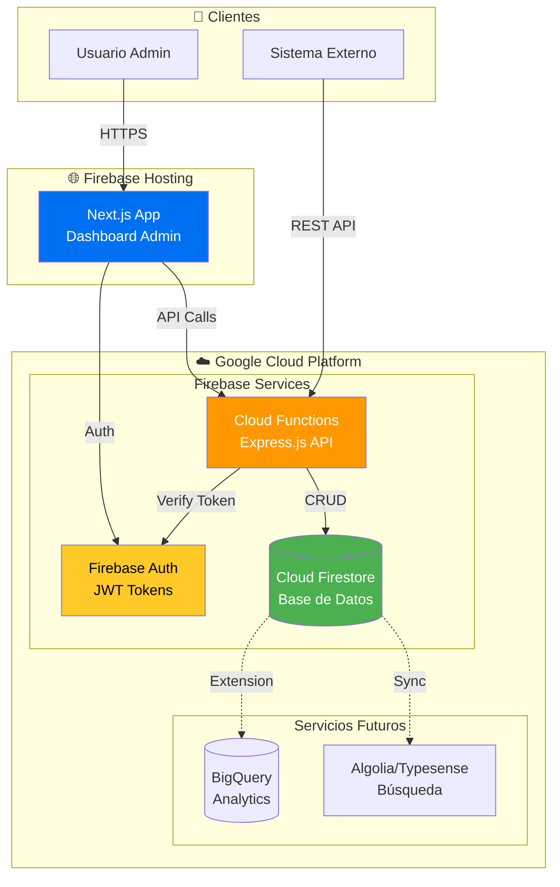
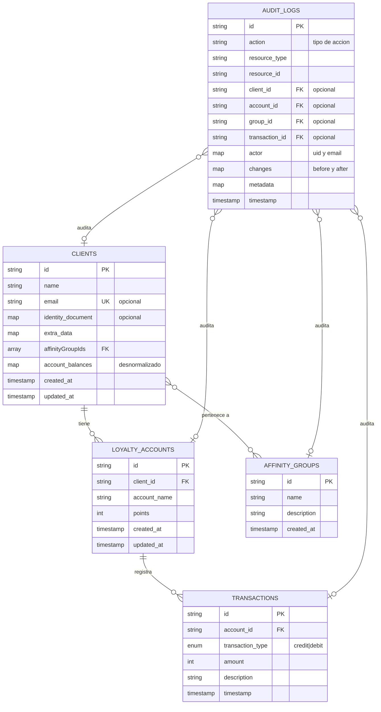
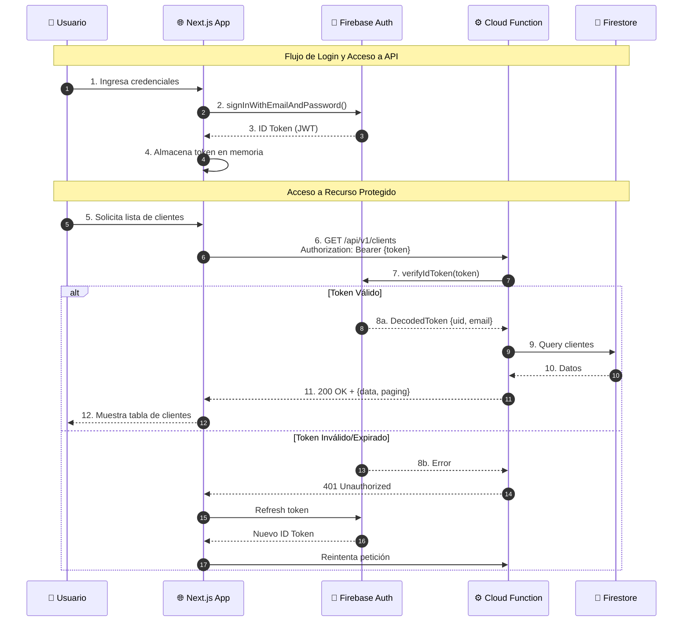
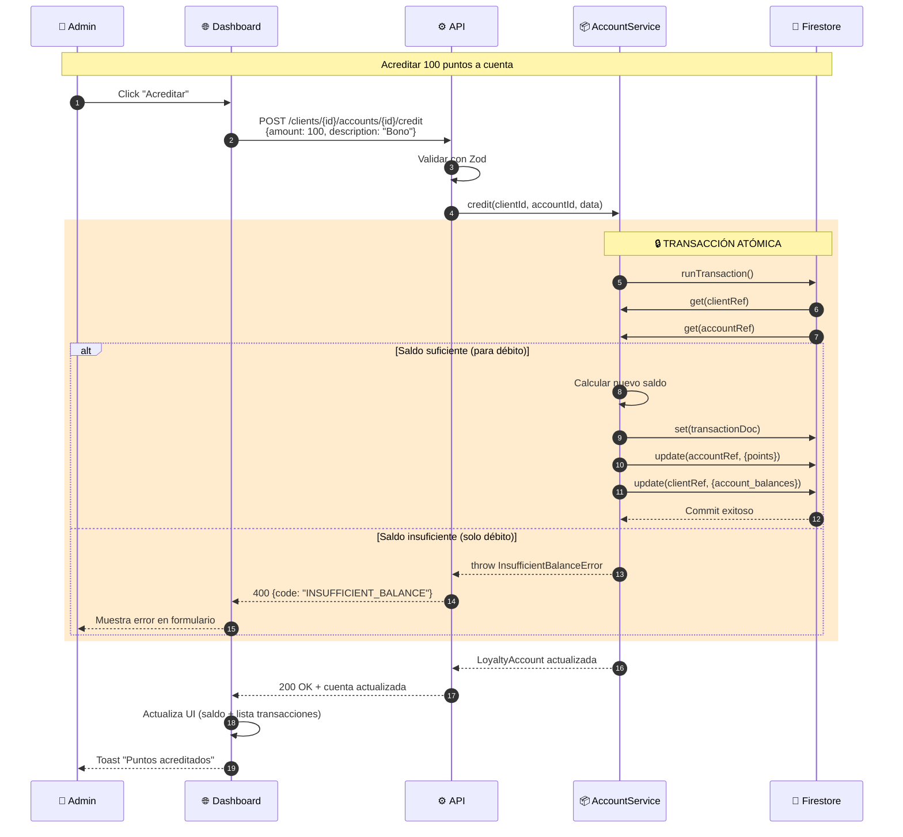
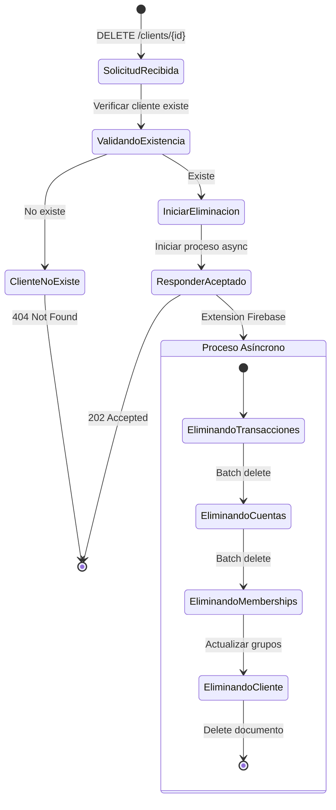
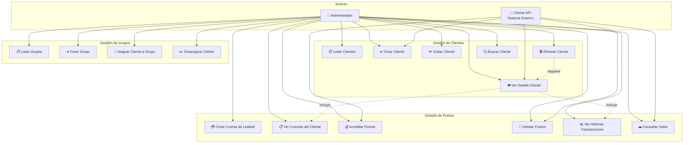
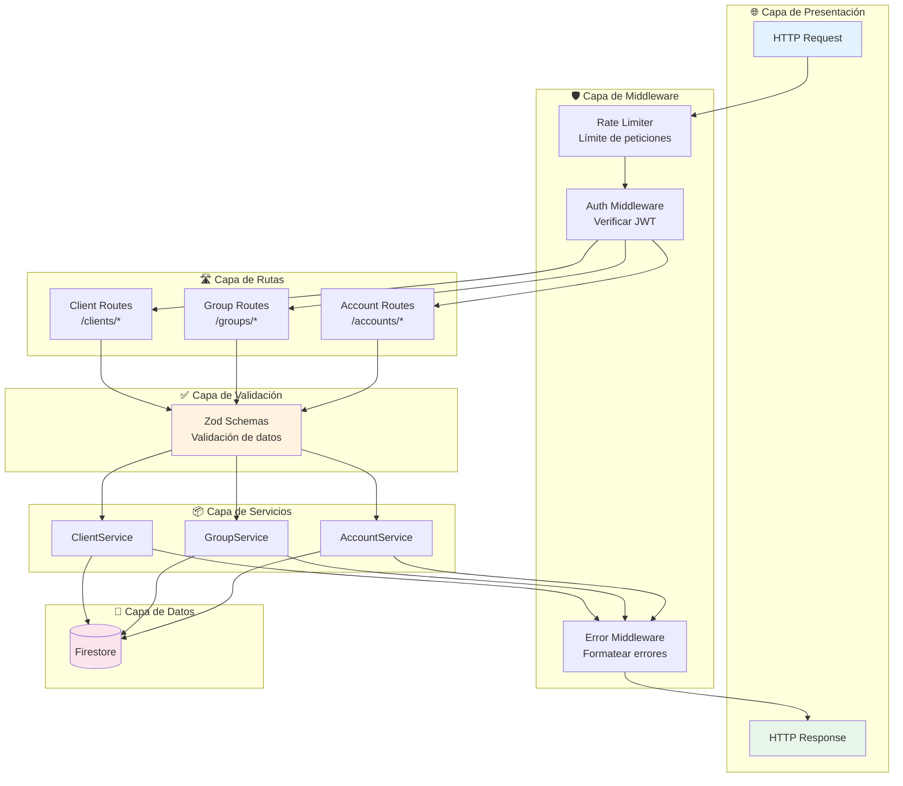
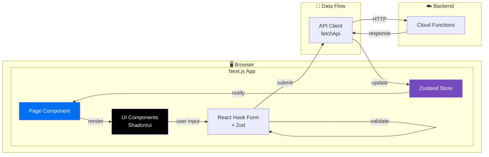

# 📚 Documentación de LoyaltyGen

**Guía completa de navegación para la documentación del proyecto**

---

## 📑 Índice de Documentación

Este directorio contiene toda la documentación técnica y funcional del proyecto LoyaltyGen. Los documentos están organizados por categorías para facilitar su consulta.

### 🎯 Por Dónde Empezar

| Si quieres... | Lee primero... |
|---------------|----------------|
| Entender qué es LoyaltyGen | [STEERING.md](./STEERING.md) - Manifiesto del Producto |
| Conocer la arquitectura técnica | [ARCHITECTURE.md](./ARCHITECTURE.md) - Arquitectura del Sistema |
| Integrar la API | [API-DESIGN.md](./API-DESIGN.md) + [openapi.yaml](../openapi.yaml) |
| Implementar funcionalidades | [WORK-PLAN.md](../WORK-PLAN.md) - Plan de Trabajo |
| Contribuir código | [GUIDELINES.md](./GUIDELINES.md) - Directrices de Codificación |

---

## 📂 Estructura de la Documentación

### 🏛️ Documentos Fundacionales

| Documento | Descripción | Audiencia |
|-----------|-------------|-----------|
| [STEERING.md](./STEERING.md) | Visión, misión y principios rectores del proyecto | Todos |
| [DESIGN.md](./DESIGN.md) | Registro de Decisiones de Arquitectura (ADR) | Tech Lead, Arquitectos |

### 🔧 Documentos Técnicos

| Documento | Descripción | Audiencia |
|-----------|-------------|-----------|
| [ARCHITECTURE.md](./ARCHITECTURE.md) | Arquitectura del sistema, componentes y estrategias | Desarrolladores Backend |
| [API-DESIGN.md](./API-DESIGN.md) | Convenciones de API, versionado y formatos | Desarrolladores API |
| [SPECS.md](./SPECS.md) | Requisitos funcionales y no funcionales | QA, Desarrolladores |
| [GUIDELINES.md](./GUIDELINES.md) | Estilo de código, tipado y políticas | Todos los Desarrolladores |

### 🎨 Documentos de Frontend

| Documento | Descripción | Audiencia |
|-----------|-------------|-----------|
| [UI-UX-GUIDELINES.md](./UI-UX-GUIDELINES.md) | Principios de diseño, componentes y patrones | Desarrolladores Frontend |
| [USER-STORIES.md](./USER-STORIES.md) | Historias de usuario del dashboard | Product Owner, Frontend |

### 🔍 Documentos de Referencia

| Documento | Descripción | Audiencia |
|-----------|-------------|-----------|
| [ARCHITECTURE_AUDIT.md](./ARCHITECTURE_AUDIT.md) | Auditoría de arquitectura y recomendaciones | Tech Lead |
| [RECOMMENDATIONS.md](./RECOMMENDATIONS.md) | Informe de auditoría con mitigaciones aplicadas | Tech Lead |

---

## 🗺️ Diagramas de Arquitectura

### Arquitectura de Alto Nivel

### Modelo de Datos (Firestore)

### Flujo de Autenticación

### Flujo de Transacción de Puntos (Crédito/Débito)

### Flujo de Eliminación Asíncrona

### Casos de Uso del Sistema

### Arquitectura de Capas (Backend)

### Flujo de Datos en el Frontend

---

## 🔗 Referencias Rápidas

### Endpoints de la API

| Método | Endpoint | Descripción |
|--------|----------|-------------|
| `GET` | `/api/v1/clients` | Listar clientes (paginado) |
| `POST` | `/api/v1/clients` | Crear cliente |
| `GET` | `/api/v1/clients/{id}` | Obtener cliente |
| `PUT` | `/api/v1/clients/{id}` | Actualizar cliente |
| `DELETE` | `/api/v1/clients/{id}` | Eliminar cliente (async) |
| `GET` | `/api/v1/groups` | Listar grupos |
| `POST` | `/api/v1/groups` | Crear grupo |
| `POST` | `/api/v1/groups/{id}/clients/{id}` | Asignar cliente a grupo |
| `DELETE` | `/api/v1/groups/{id}/clients/{id}` | Desasignar cliente |
| `GET` | `/api/v1/clients/{id}/accounts` | Listar cuentas |
| `POST` | `/api/v1/clients/{id}/accounts` | Crear cuenta |
| `POST` | `/api/v1/clients/{id}/accounts/{id}/credit` | Acreditar puntos |
| `POST` | `/api/v1/clients/{id}/accounts/{id}/debit` | Debitar puntos |
| `GET` | `/api/v1/clients/{id}/accounts/{id}/transactions` | Historial |
| `GET` | `/api/v1/clients/{id}/balance` | Todos los saldos |

### Códigos de Error

| Código HTTP | Código de Error | Descripción |
|-------------|-----------------|-------------|
| 400 | `VALIDATION_FAILED` | Error de validación de datos |
| 400 | `INSUFFICIENT_BALANCE` | Saldo insuficiente para débito |
| 400 | `MISSING_IDENTIFIER` | Falta email o documento de identidad |
| 401 | `INVALID_TOKEN` | Token JWT inválido o expirado |
| 404 | `RESOURCE_NOT_FOUND` | Recurso no encontrado |
| 409 | `EMAIL_ALREADY_EXISTS` | Email duplicado |
| 409 | `IDENTITY_DOCUMENT_ALREADY_EXISTS` | Documento duplicado |
| 500 | `INTERNAL_SERVER_ERROR` | Error interno del servidor |

---

## 📋 Checklist de Lectura por Rol

### Para Nuevos Desarrolladores
- [ ] Leer [STEERING.md](./STEERING.md) para entender la visión
- [ ] Revisar [ARCHITECTURE.md](./ARCHITECTURE.md) para la arquitectura
- [ ] Estudiar [GUIDELINES.md](./GUIDELINES.md) para convenciones de código
- [ ] Consultar [WORK-PLAN.md](../WORK-PLAN.md) para tareas

### Para Desarrolladores Backend
- [ ] [ARCHITECTURE.md](./ARCHITECTURE.md) - Modelo de datos y servicios
- [ ] [API-DESIGN.md](./API-DESIGN.md) - Convenciones de API
- [ ] [SPECS.md](./SPECS.md) - Requisitos funcionales
- [ ] [openapi.yaml](../openapi.yaml) - Contrato de API

### Para Desarrolladores Frontend
- [ ] [UI-UX-GUIDELINES.md](./UI-UX-GUIDELINES.md) - Diseño de interfaz
- [ ] [USER-STORIES.md](./USER-STORIES.md) - Funcionalidades a implementar
- [ ] [API-DESIGN.md](./API-DESIGN.md) - Formato de respuestas

### Para Tech Lead / Arquitecto
- [ ] [DESIGN.md](./DESIGN.md) - Decisiones de arquitectura
- [ ] [ARCHITECTURE_AUDIT.md](./ARCHITECTURE_AUDIT.md) - Análisis de riesgos
- [ ] [RECOMMENDATIONS.md](./RECOMMENDATIONS.md) - Mitigaciones aplicadas

---

**[⬅️ Volver al README Principal](../README.md)**

